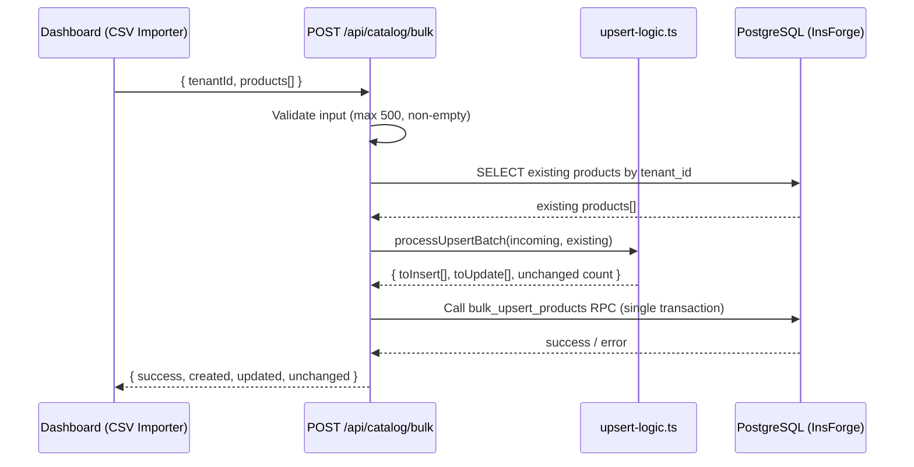

# Design Document: CSV Import Upsert

## Overview

This design converts the existing `POST /api/catalog/bulk` endpoint from a blind INSERT operation into an intelligent upsert that matches products by name (case-insensitive, trimmed) within a tenant, updates only when fields have changed, inserts new products, and returns a detailed summary of actions taken.

The core logic is extracted into a pure, testable `processUpsertBatch` function that handles deduplication within the batch, matching against existing products, and change detection. The endpoint orchestrates the database transaction around this logic.

### Key Design Decisions

1. **Pure logic extraction**: The matching, deduplication, and change detection logic lives in a separate module (`upsert-logic.ts`) that can be unit-tested without database dependencies.
2. **Single query for existing products**: Fetch all existing products for the tenant with matching names in one SELECT, rather than N+1 queries.
3. **Transaction via InsForge RPC**: Use a PostgreSQL function (`bulk_upsert_products`) to guarantee atomicity, since the InsForge SDK doesn't expose explicit transaction control.
4. **Backward-compatible response**: The response includes `success: true` alongside the new `created`, `updated`, `unchanged` counts.

## Architecture



### Component Responsibilities

| Component | Responsibility |
|-----------|---------------|
| `scripts/dashboard.js` | CSV parsing, client-side validation, display Import_Summary toast |
| `server.ts` (endpoint) | Request validation, fetch existing products, orchestrate upsert, return response |
| `upsert-logic.ts` | Pure functions: normalizeName, detectChanges, processUpsertBatch |
| `sql/006-bulk-upsert.sql` | PostgreSQL function for atomic insert + update in a single transaction |

## Components and Interfaces

### 1. `upsert-logic.ts` — Pure Logic Module

```typescript
// Types
interface IncomingProduct {
  name: string;
  description?: string | null;
  price: number;
  stock?: number | null;
  image_url?: string | null;
}

interface ExistingProduct {
  id: string;
  tenant_id: string;
  name: string;
  description: string | null;
  price: number;
  stock: number;
  image_url: string | null;
  created_at: string;
}

interface UpsertAction {
  type: 'insert' | 'update' | 'unchanged';
  product: IncomingProduct;
  existingId?: string; // present for update/unchanged
}

interface UpsertBatchResult {
  actions: UpsertAction[];
  toInsert: IncomingProduct[];
  toUpdate: Array<{ id: string; fields: Partial<IncomingProduct> }>;
  unchangedCount: number;
}

// Functions
function normalizeName(name: string): string;
function normalizeFields(product: IncomingProduct): { description: string | null; price: number; stock: number; image_url: string | null };
function hasChanges(incoming: IncomingProduct, existing: ExistingProduct): boolean;
function deduplicateBatch(products: IncomingProduct[]): Map<string, IncomingProduct>;
function processUpsertBatch(incoming: IncomingProduct[], existing: ExistingProduct[]): UpsertBatchResult;
```

### 2. `server.ts` — Updated Bulk Endpoint

```typescript
// POST /api/catalog/bulk — updated handler
// 1. Validate tenantId, products array, max 500
// 2. Fetch all existing products for tenant matching incoming names
// 3. Call processUpsertBatch(incoming, existing)
// 4. Execute atomic DB operation (RPC or sequential insert+update in transaction)
// 5. Return { success: true, created, updated, unchanged }
```

### 3. `sql/006-bulk-upsert.sql` — Database Migration

```sql
-- Adds updated_at column to products table
-- Creates bulk_upsert_products function for atomic operations
```

### 4. `scripts/dashboard.js` — Updated CSV Importer

The `handleCSVImport` function is updated to:
- Enforce 500-product client-side limit before sending
- Display the new Import_Summary fields (created/updated/unchanged) in the toast
- Show validation-skipped count alongside

## Data Models

### Products Table (Updated Schema)

```sql
CREATE TABLE products (
    id UUID PRIMARY KEY DEFAULT gen_random_uuid(),
    tenant_id UUID NOT NULL REFERENCES companies(id) ON DELETE CASCADE,
    name TEXT NOT NULL,
    description TEXT,
    price NUMERIC(10,2) NOT NULL,
    stock INTEGER NOT NULL DEFAULT 0,
    image_url TEXT,
    created_at TIMESTAMPTZ DEFAULT now(),
    updated_at TIMESTAMPTZ DEFAULT now()  -- NEW COLUMN
);

-- New index for upsert matching performance
CREATE INDEX idx_products_tenant_name ON products(tenant_id, lower(trim(name)));
```

### Migration: `sql/006-bulk-upsert.sql`

```sql
-- Add updated_at column
ALTER TABLE products ADD COLUMN IF NOT EXISTS updated_at TIMESTAMPTZ DEFAULT now();

-- Backfill existing rows
UPDATE products SET updated_at = created_at WHERE updated_at IS NULL;

-- Index for efficient name lookups during upsert
CREATE INDEX IF NOT EXISTS idx_products_tenant_name 
ON products(tenant_id, lower(trim(name)));
```

### API Request/Response Shapes

**Request** (unchanged):
```json
{
  "tenantId": "uuid-string",
  "products": [
    { "name": "Product A", "description": "...", "price": 10.99, "stock": 5, "image_url": "..." }
  ]
}
```

**Success Response** (enhanced):
```json
{
  "success": true,
  "created": 3,
  "updated": 2,
  "unchanged": 5
}
```

**Error Response** (unchanged):
```json
{
  "error": "Error message string"
}
```


## Correctness Properties

*A property is a characteristic or behavior that should hold true across all valid executions of a system—essentially, a formal statement about what the system should do. Properties serve as the bridge between human-readable specifications and machine-verifiable correctness guarantees.*

### Property 1: Name Normalization is Case-Insensitive and Trim-Invariant

*For any* product name string, `normalizeName(name)` SHALL produce the same result regardless of letter casing or leading/trailing whitespace. That is, `normalizeName("  Foo BAR  ")` === `normalizeName("foo bar")` === `normalizeName("FOO BAR")`.

**Validates: Requirements 1.1, 1.3**

### Property 2: Batch Deduplication Last-Wins

*For any* array of incoming products where two or more entries share the same normalized name, `deduplicateBatch` SHALL return a map containing exactly one entry per unique normalized name, and that entry SHALL have the field values from the last occurrence in the original array order.

**Validates: Requirements 1.4, 3.3**

### Property 3: Changed Products are Classified as Updates

*For any* incoming product and matching existing product (same normalized name) where at least one comparable field differs after normalization, `processUpsertBatch` SHALL classify that product as an `update`.

**Validates: Requirements 2.1**

### Property 4: Identical Products are Classified as Unchanged

*For any* incoming product and matching existing product (same normalized name) where all comparable fields are identical after normalization, `processUpsertBatch` SHALL classify that product as `unchanged`.

**Validates: Requirements 2.2**

### Property 5: Field Normalization Equivalences

*For any* incoming product fields, `normalizeFields` SHALL:
- Round `price` to 2 decimal places
- Round `stock` to integer (defaulting to 0 if missing)
- Trim text fields (`description`, `image_url`) and treat `null`, `undefined`, and empty string as equivalent (all normalize to `null`)

Such that two field sets that differ only by these equivalences produce the same normalized output.

**Validates: Requirements 2.3, 2.4, 3.4**

### Property 6: Unmatched Products are Classified as Inserts

*For any* incoming product whose normalized name does not appear in the existing products list, `processUpsertBatch` SHALL classify that product as an `insert`.

**Validates: Requirements 3.1**

### Property 7: Result Counts are a Partition of the Deduplicated Batch

*For any* deduplicated batch of N unique products processed by `processUpsertBatch`, the sum `toInsert.length + toUpdate.length + unchangedCount` SHALL always equal N.

**Validates: Requirements 4.1**

## Error Handling

| Scenario | Handler | Response |
|----------|---------|----------|
| Missing `tenantId` | Endpoint validation | 400 `{ error: "Falta tenantId" }` |
| Empty or non-array `products` | Endpoint validation | 400 `{ error: "No hay productos para importar" }` |
| Batch > 500 products | Endpoint validation | 400 `{ error: "Máximo 500 productos por importación" }` |
| Database transaction failure | Endpoint catch | 500 `{ error: "<reason>" }` with full rollback |
| Individual field type errors | `normalizeFields` | Graceful coercion (NaN price → 0, non-numeric stock → 0) |
| Network error (client) | `handleCSVImport` | Toast: "Error de conexión al importar" |
| All CSV rows invalid (client) | `handleCSVImport` | Toast: "No se encontraron productos válidos en el archivo" (no API call made) |

### Error Handling Strategy

1. **Validation-first**: All input validation happens before any database query. Invalid requests are rejected immediately.
2. **Fail-atomic**: The database operation uses a single transaction. Any failure rolls back everything.
3. **Graceful coercion over rejection**: For individual field values within valid rows, coerce to safe defaults rather than rejecting the entire batch (e.g., a non-numeric stock becomes 0).
4. **Client-side pre-validation**: The CSV parser validates each row. Rows missing `name` or with non-numeric `price` are skipped and counted, but don't prevent the rest from importing.

## Testing Strategy

### Property-Based Testing

This feature is well-suited for property-based testing because the core logic (`upsert-logic.ts`) consists of pure functions with clear input/output behavior, large input spaces (arbitrary product names, field values), and universal properties that must hold for all inputs.

**Library**: [fast-check](https://github.com/dubzzz/fast-check) (TypeScript-native PBT library)

**Configuration**:
- Minimum 100 iterations per property test
- Each test tagged with: `Feature: csv-import-upsert, Property {N}: {title}`

**Properties to implement**:
1. Name normalization idempotence and equivalence (Property 1)
2. Batch deduplication last-wins ordering (Property 2)
3. Changed products → update classification (Property 3)
4. Identical products → unchanged classification (Property 4)
5. Field normalization equivalences (Property 5)
6. Unmatched products → insert classification (Property 6)
7. Result count partition invariant (Property 7)

### Unit Tests (Example-Based)

- `normalizeName` with specific edge cases: empty string after trim, unicode characters, multiple internal spaces
- `hasChanges` with specific known field differences
- `processUpsertBatch` with legacy duplicates in existing (picks latest `created_at`) — Req 1.2
- Endpoint returns 400 for > 500 products — Req 5.4
- Endpoint response includes `success: true` — Req 6.2

### Integration Tests

- Full endpoint call with mixed inserts/updates/unchanged, verify response counts match database state
- Transaction atomicity: simulate DB failure mid-operation, verify no partial writes persist
- Verify `tenant_id` is correctly assigned to new inserts — Req 3.2
- Verify `updated_at` is set on updates but not on unchanged products

### Frontend Tests (Manual/UI)

- CSV import shows toast with created/updated/unchanged counts — Req 4.2
- CSV with all invalid rows shows error toast without API call — Req 4.4, 5.3
- Toast includes skipped row count — Req 4.3
