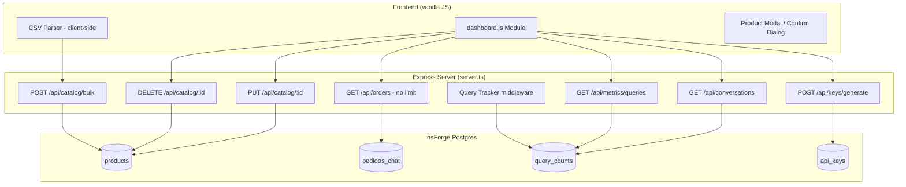

# Design Document: Dashboard Completion

## Overview

This design covers the implementation of seven missing features in the Eteba Chat administration dashboard: product editing, product deletion, conversations tab, full orders listing, CSV product import, API key generation, and query count metrics.

The solution extends the existing Express server (`server.ts`) with new API endpoints (PUT/DELETE for products, bulk insert, API key generation, query tracking) and enhances the frontend (`scripts/dashboard.js`) with the corresponding UI interactions — all using the established patterns of InsForge SDK for database operations and vanilla JavaScript for the frontend.

### Key Design Decisions

1. **Server-side validation**: All CRUD operations validate input on the server before touching the database, matching the existing pattern in `server.ts`.
2. **No new dependencies**: CSV parsing is done client-side with the native `FileReader` API and simple string splitting — no external library needed for the expected column format.
3. **API key as crypto-random hex**: Generated server-side using Node.js `crypto.randomBytes(32)` for security. Stored in a new `api_keys` table.
4. **Query tracking via middleware-like counter**: Increments a row in a new `query_counts` table on each `/api/query` call, keeping the tracking logic minimal and non-blocking.
5. **Confirmation dialog as reusable component**: A generic `showConfirmDialog(message)` function returns a Promise, making it composable for delete and any future destructive action.

---

## Architecture



---

## Components and Interfaces

### 1. Catalog API Extensions (server.ts)

**PUT `/api/catalog/:id`** — Update a product

```typescript
interface UpdateProductRequest {
  tenantId: string;
  name?: string;
  description?: string;
  price?: number;
  stock?: number;
  image_url?: string;
}

interface UpdateProductResponse {
  success: boolean;
  product?: Product;
  error?: string;
}
```

**DELETE `/api/catalog/:id`** — Delete a product

```typescript
interface DeleteProductRequest {
  tenantId: string; // query param or body
}

interface DeleteProductResponse {
  success: boolean;
  error?: string;
}
```

**POST `/api/catalog/bulk`** — Bulk insert products from CSV

```typescript
interface BulkInsertRequest {
  tenantId: string;
  products: Array<{
    name: string;
    description?: string;
    price: number;
    stock?: number;
    image_url?: string;
  }>;
}

interface BulkInsertResponse {
  success: boolean;
  inserted: number;
  error?: string;
}
```

### 2. API Key Generator (server.ts)

**POST `/api/keys/generate`** — Generate a new API key

```typescript
interface GenerateKeyRequest {
  tenantId: string;
}

interface GenerateKeyResponse {
  success: boolean;
  key?: string;
  error?: string;
}
```

### 3. Query Tracker (server.ts)

**GET `/api/metrics/queries?tenantId=xxx`** — Get query count

```typescript
interface QueryMetricsResponse {
  count: number;
}
```

The tracker is a function called inside the existing `POST /api/query` handler that increments the counter after a successful response.

### 4. Conversations Endpoint (server.ts)

**GET `/api/conversations?tenantId=xxx&limit=50`** — Fetch recent queries

```typescript
interface Conversation {
  id: string;
  query_text: string;
  user_id?: string;
  created_at: string;
}

interface ConversationsResponse {
  conversations: Conversation[];
}
```

### 5. CSV Parser (client-side, in dashboard.js)

```javascript
/**
 * Parses a CSV string into an array of product objects.
 * @param {string} csvText - Raw CSV file content
 * @returns {{ valid: Array<Product>, skipped: number }}
 */
function parseCSV(csvText) { ... }
```

Expected CSV format:
```
name,description,price,stock,image_url
"Zapatilla Nike","Running shoe",45000,10,"https://..."
```

### 6. Frontend Components (dashboard.js)

- `showProductModal(product?)` — Opens create/edit modal. If `product` is passed, fields are pre-filled and save triggers PUT instead of POST.
- `showConfirmDialog(message)` — Returns a `Promise<boolean>`. Resolves `true` on confirm, `false` on cancel.
- `loadConversations(tenantId)` — Fetches and renders the conversations tab.
- `loadAllOrders(tenantId)` — Fetches all orders (no slice) and renders the full table.
- `handleCSVImport(tenantId)` — Opens file picker, parses CSV, calls bulk endpoint.
- `generateApiKey(tenantId)` — Calls key generation endpoint, displays result.
- `loadQueryMetrics(tenantId)` — Fetches query count and updates the metric card.

---

## Data Models

### New Table: `api_keys`

```sql
CREATE TABLE api_keys (
  id UUID PRIMARY KEY DEFAULT gen_random_uuid(),
  tenant_id UUID NOT NULL REFERENCES companies(id) ON DELETE CASCADE,
  key_value TEXT NOT NULL UNIQUE,
  label TEXT DEFAULT 'default',
  created_at TIMESTAMPTZ DEFAULT now()
);

CREATE INDEX idx_api_keys_tenant ON api_keys(tenant_id);
```

### New Table: `query_counts`

```sql
CREATE TABLE query_counts (
  id UUID PRIMARY KEY DEFAULT gen_random_uuid(),
  tenant_id UUID NOT NULL REFERENCES companies(id) ON DELETE CASCADE,
  query_text TEXT NOT NULL,
  user_id TEXT,
  created_at TIMESTAMPTZ DEFAULT now()
);

CREATE INDEX idx_query_counts_tenant ON query_counts(tenant_id);
CREATE INDEX idx_query_counts_created ON query_counts(created_at DESC);
```

### Existing Tables (no schema changes needed)

- `products` — already has all fields needed (id, tenant_id, name, description, price, stock, image_url)
- `pedidos_chat` — already has order fields (producto_nombre, cliente_nombre, ciudad_entrega, created_at)

---

## Correctness Properties

*A property is a characteristic or behavior that should hold true across all valid executions of a system — essentially, a formal statement about what the system should do. Properties serve as the bridge between human-readable specifications and machine-verifiable correctness guarantees.*

### Property 1: Product update round-trip

*For any* valid product and any valid update payload (non-empty name, numeric price ≥ 0, integer stock ≥ 0), updating the product via PUT and then fetching it should return a product with fields matching the update payload.

**Validates: Requirements 1.2**

### Property 2: Product delete invariant

*For any* existing product, after a successful DELETE request, querying that product by ID should return no results.

**Validates: Requirements 2.3**

### Property 3: Conversations limited and ordered

*For any* set of N query records for a tenant (where N may exceed 50), the conversations endpoint SHALL return at most 50 entries, and those entries SHALL be the N most recent ones ordered by timestamp descending.

**Validates: Requirements 3.4, 3.5**

### Property 4: Conversation rendering completeness

*For any* conversation record containing a query_text, created_at timestamp, and optional user_id, the rendered table row SHALL contain the query text, a formatted timestamp, and the user identifier (or a placeholder if absent).

**Validates: Requirements 3.2**

### Property 5: Orders API returns all records ordered descending

*For any* tenant with N orders (N > 0), the orders endpoint SHALL return all N orders sorted by created_at descending, with no artificial limit.

**Validates: Requirements 4.1, 4.3**

### Property 6: Orders rendering completeness

*For any* order record, the rendered table row SHALL contain the product name, client name, delivery city, and formatted date.

**Validates: Requirements 4.2**

### Property 7: CSV parsing correctness

*For any* CSV text with a header row followed by data rows, each row with a non-empty `name` and a numeric `price` SHALL produce a valid product object, each row missing `name` or `price` SHALL be skipped, and the sum of valid products + skipped rows SHALL equal the total data row count.

**Validates: Requirements 5.2, 5.5**

### Property 8: Bulk insert persists all products

*For any* array of N valid product objects sent to the bulk insert endpoint, querying the products table for that tenant should return at least N new products matching the submitted data.

**Validates: Requirements 5.3**

### Property 9: API key uniqueness

*For any* sequence of K key generation requests (same or different tenants), all K generated key values SHALL be distinct.

**Validates: Requirements 6.1**

### Property 10: API key persistence round-trip

*For any* generated API key, querying the `api_keys` table by key value should return exactly one record associated with the correct tenant ID.

**Validates: Requirements 6.3**

### Property 11: Query counter monotonic increment

*For any* sequence of N successful queries processed via `/api/query` for a given tenant, the total count in `query_counts` for that tenant SHALL equal N.

**Validates: Requirements 7.1**

---

## Error Handling

| Scenario | Response | User-Facing Behavior |
|----------|----------|---------------------|
| PUT/DELETE with invalid product ID | 404 `{ error: "Producto no encontrado" }` | Error toast with message |
| PUT with missing `tenantId` | 400 `{ error: "Falta tenantId" }` | Error toast |
| PUT with empty `name` | 400 `{ error: "El nombre es obligatorio" }` | Error toast |
| DELETE product not owned by tenant | 403 `{ error: "No autorizado" }` | Error toast |
| Bulk insert with empty array | 400 `{ error: "No hay productos para importar" }` | Error toast |
| CSV file unreadable / malformed | Client-side error | Toast: "El formato del archivo no es válido" |
| API key generation DB failure | 500 `{ error: "..." }` | Error toast with message |
| Query metrics fetch failure | Client fallback | Display "0" |
| Network timeout on any fetch | Client catch | Generic error toast |

All server errors follow the existing pattern: `res.status(code).json({ error: message })`. The frontend `showToast(message, 'error')` function handles display uniformly.

---

## Testing Strategy

### Property-Based Tests

This feature has significant pure-logic components (CSV parsing, data validation, rendering functions) that are well-suited to property-based testing.

- **Library**: [fast-check](https://github.com/dubzzz/fast-check) (JavaScript/TypeScript PBT library)
- **Minimum iterations**: 100 per property test
- **Tag format**: `Feature: dashboard-completion, Property {number}: {property_text}`

Properties 1, 2, 5, 8, 10, 11 test server-side logic and will use mocked InsForge database calls to keep tests fast and cost-free. Properties 3, 4, 6, 7, 9 test pure functions (rendering, parsing, key uniqueness) and run entirely in-memory.

### Unit Tests (Example-Based)

- Product modal pre-fills correctly with known product data (Req 1.1)
- Cancel on confirmation dialog does not trigger delete (Req 2.5)
- Empty conversation list shows placeholder message (Req 3.3)
- Failed orders fetch shows error message (Req 4.4)
- File input accepts only `.csv` files (Req 5.1)
- Malformed CSV shows error toast (Req 5.6)
- Generated key appears in UI (Req 6.2)
- Copy-to-clipboard works (Req 6.4)
- Query metric shows integer replacing "—" (Req 7.3)
- Failed metric fetch defaults to "0" (Req 7.4)

### Integration Tests

- Full flow: create product → edit product → verify updated → delete product → verify gone
- Full flow: import CSV → verify products in catalog → verify count toast
- Full flow: send queries → check conversations tab → check metrics count
- Full flow: generate API key → verify stored in DB → verify displayed in UI
