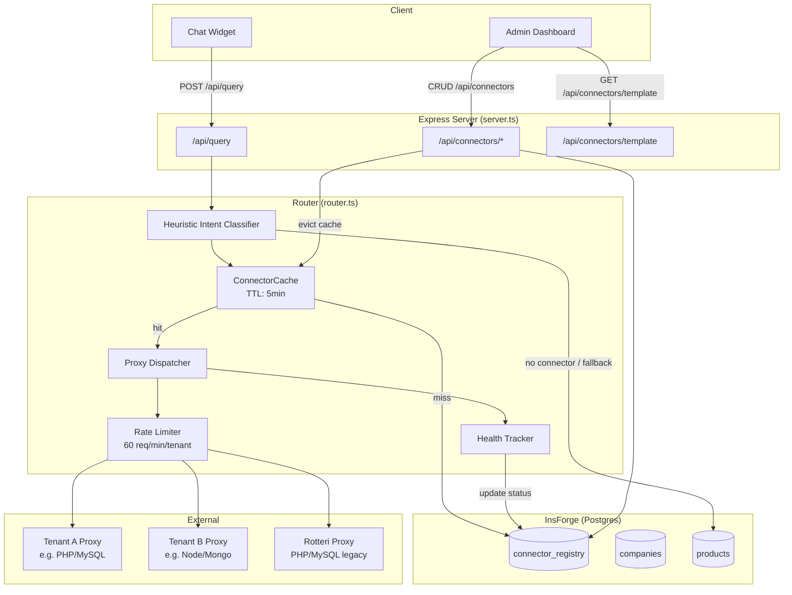
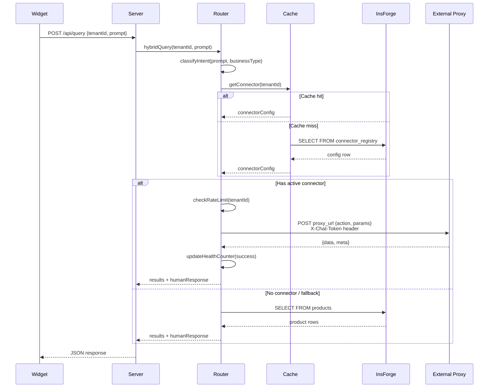

# Design Document: Tenant Data Connectors

## Overview

This feature generalizes the existing hardcoded Rotteri MySQL proxy integration into a configurable, multi-tenant data connector system. Any tenant can register an external proxy endpoint through the dashboard, enabling Eteba Chat's AI assistant to query their business data (products, appointments, menus, services) via a standardized HTTP JSON protocol.

The system introduces:
- A **Connector Registry** (InsForge/Postgres table) storing per-tenant proxy configurations
- A **generalized Router** that dynamically dispatches queries based on tenant config rather than hardcoded tenant IDs
- A **Dashboard UI section** for connector management with test-connection and health monitoring
- A **Template Generator** producing ready-to-deploy proxy files (PHP, Node.js, Python) per business type
- **Backward compatibility** with the existing Rotteri integration via environment variable fallback

### Design Decisions

1. **Single active connector per tenant**: Simplifies routing logic and avoids ambiguity. Tenants wanting multiple data sources can aggregate behind a single proxy.
2. **Token stored encrypted at rest**: Uses AES-256-GCM encryption with a server-managed key. The token is only decrypted when making outbound proxy requests.
3. **In-memory cache with 5-minute TTL**: Avoids per-request DB lookups for connector config while keeping changes responsive. Cache is evicted on CRUD operations.
4. **Failure counter for health (3 consecutive failures)**: Balances between transient errors and genuine outages. Only consecutive chat-usage failures trigger the error state.
5. **Rate limiting at 60 req/min per tenant**: Protects external proxies from abuse via sliding window implemented server-side.

## Architecture



### Request Flow



## Components and Interfaces

### 1. ConnectorRegistry Module (`connector-registry.ts`)

Handles all CRUD operations and validation for connector configurations.

```typescript
interface ConnectorConfig {
  id: string;              // UUID
  tenant_id: string;       // UUID, FK to companies
  proxy_url: string;       // HTTPS URL, max 2048 chars
  connector_token: string; // Encrypted at rest, 64-char hex
  business_type: BusinessType;
  display_name: string;    // max 128 chars
  enabled: boolean;
  status: 'active' | 'inactive' | 'error';
  last_error: string | null;
  last_error_at: string | null;
  failure_count: number;
  created_at: string;
  updated_at: string;
}

type BusinessType = 'ecommerce' | 'appointments' | 'restaurant' | 'services' | 'general';

interface ConnectorCreateInput {
  proxy_url: string;
  connector_token?: string; // Auto-generated if not provided
  business_type: BusinessType;
  display_name: string;
}

interface ConnectorUpdateInput {
  proxy_url?: string;
  connector_token?: string;
  business_type?: BusinessType;
  display_name?: string;
  enabled?: boolean;
}

// Public API
function createConnector(tenantId: string, input: ConnectorCreateInput): Promise<ConnectorConfig>;
function getConnector(tenantId: string): Promise<ConnectorConfig | null>;
function updateConnector(tenantId: string, input: ConnectorUpdateInput): Promise<ConnectorConfig>;
function deleteConnector(tenantId: string): Promise<void>;
function generateToken(): string; // crypto.randomBytes(32).toString('hex')
```

### 2. ConnectorCache (`connector-cache.ts`)

In-memory LRU-like cache with TTL eviction.

```typescript
interface CachedConnector {
  config: ConnectorConfig;
  cachedAt: number;
}

class ConnectorCache {
  private cache: Map<string, CachedConnector>;
  private readonly TTL = 5 * 60 * 1000; // 5 minutes

  get(tenantId: string): ConnectorConfig | null;
  set(tenantId: string, config: ConnectorConfig): void;
  evict(tenantId: string): void;
  isExpired(entry: CachedConnector): boolean;
}
```

### 3. ProxyDispatcher (`proxy-dispatcher.ts`)

Handles outbound HTTP calls to external proxies with timeout, auth, and error handling.

```typescript
interface ProxyRequest {
  action: string;
  params: Record<string, any>;
}

interface ProxyResponse {
  data: any;
  meta: {
    timestamp: string;
    action: string;
    execution_time_ms: number;
  };
  error?: string;
}

class ProxyDispatcher {
  private readonly TIMEOUT = 8000; // 8 seconds

  async dispatch(config: ConnectorConfig, request: ProxyRequest): Promise<ProxyResponse>;
  private buildHeaders(token: string): Record<string, string>;
  private handleError(error: unknown, config: ConnectorConfig): ProxyResponse;
}
```

### 4. HealthTracker (`health-tracker.ts`)

Tracks consecutive failures per tenant and updates connector status.

```typescript
class HealthTracker {
  private failureCounts: Map<string, number>;
  private readonly THRESHOLD = 3;

  recordSuccess(tenantId: string): void;
  recordFailure(tenantId: string, error: string): Promise<void>;
  getStatus(tenantId: string): 'active' | 'error';
  resetStatus(tenantId: string): Promise<void>;
}
```

### 5. RateLimiter (`rate-limiter.ts`)

Sliding window rate limiter per tenant.

```typescript
class RateLimiter {
  private windows: Map<string, number[]>; // tenant -> timestamps
  private readonly MAX_REQUESTS = 60;
  private readonly WINDOW_MS = 60 * 1000; // 1 minute

  isAllowed(tenantId: string): boolean;
  record(tenantId: string): void;
  getRetryAfter(tenantId: string): number; // seconds
}
```

### 6. IntentMapper (`intent-mapper.ts`)

Maps heuristic classification results to proxy actions based on business type.

```typescript
type ProxyAction = string;

interface ActionMapping {
  ecommerce: Record<string, ProxyAction>;
  appointments: Record<string, ProxyAction>;
  restaurant: Record<string, ProxyAction>;
  services: Record<string, ProxyAction>;
}

function mapIntentToAction(
  intentType: string,
  businessType: BusinessType,
  query: string
): { action: ProxyAction; params: Record<string, any> };

function getBusinessTypeKeywords(businessType: BusinessType): string[];
function getSystemPromptInstructions(businessType: BusinessType): string;
```

### 7. TemplateGenerator (`template-generator.ts`)

Generates proxy template files based on business type and language.

```typescript
type TemplateLanguage = 'php' | 'nodejs' | 'python';

function generateTemplate(
  language: TemplateLanguage,
  businessType: BusinessType,
  connectorToken?: string
): string; // Returns file content as string
```

### 8. API Routes (additions to `server.ts`)

```typescript
// CRUD endpoints
POST   /api/connectors          // Create connector
GET    /api/connectors          // Get tenant's connector
PUT    /api/connectors          // Update connector
DELETE /api/connectors          // Delete connector

// Utility endpoints
POST   /api/connectors/test     // Test connection (ping)
POST   /api/connectors/generate-token // Generate secure token
GET    /api/connectors/template // Download proxy template

// Existing endpoint enhanced
GET    /api/config              // Now includes connector health status
```

### 9. Rotteri Compatibility Layer

The router checks for connectors in this priority order:
1. **Connector Registry record** for the tenant → use it exclusively
2. **Environment variables** `ROTTERI_PROXY_URL` + `ROTTERI_PROXY_TOKEN` → use as legacy fallback for Rotteri's tenant_id only
3. **Neither** → fall back to InsForge Postgres product search

Rotteri's existing proxy actions (`search_products`, `insert_order`, `list_stores`, `get_product_detail`) already conform to the ecommerce protocol, so no translation layer is needed — only the routing logic changes.

## Data Models

### connector_registry Table (SQL Migration)

```sql
-- 006-connector-registry.sql
CREATE TABLE connector_registry (
    id UUID PRIMARY KEY DEFAULT gen_random_uuid(),
    tenant_id UUID NOT NULL REFERENCES companies(id) ON DELETE CASCADE,
    proxy_url TEXT NOT NULL CHECK (char_length(proxy_url) <= 2048),
    connector_token_encrypted TEXT NOT NULL,  -- AES-256-GCM encrypted
    connector_token_iv TEXT NOT NULL,         -- Initialization vector
    connector_token_tag TEXT NOT NULL,        -- Auth tag
    business_type TEXT NOT NULL DEFAULT 'general'
        CHECK (business_type IN ('ecommerce', 'appointments', 'restaurant', 'services', 'general')),
    display_name TEXT NOT NULL CHECK (char_length(display_name) <= 128),
    enabled BOOLEAN NOT NULL DEFAULT true,
    status TEXT NOT NULL DEFAULT 'active'
        CHECK (status IN ('active', 'inactive', 'error')),
    failure_count INTEGER NOT NULL DEFAULT 0,
    last_error TEXT,
    last_error_at TIMESTAMPTZ,
    created_at TIMESTAMPTZ DEFAULT now(),
    updated_at TIMESTAMPTZ DEFAULT now()
);

-- Only one active connector per tenant
CREATE UNIQUE INDEX idx_connector_registry_tenant_active
    ON connector_registry(tenant_id) WHERE enabled = true;

CREATE INDEX idx_connector_registry_tenant ON connector_registry(tenant_id);

-- RLS
ALTER TABLE connector_registry ENABLE ROW LEVEL SECURITY;

CREATE POLICY connector_tenant_isolation ON connector_registry
    FOR ALL USING (tenant_id = get_current_tenant_id());
```

### Token Encryption Schema

```typescript
interface EncryptedToken {
  encrypted: string;  // Base64 ciphertext
  iv: string;         // Base64 initialization vector (12 bytes)
  tag: string;        // Base64 auth tag (16 bytes)
}

// Encryption key from env: CONNECTOR_ENCRYPTION_KEY (32 bytes hex)
// Algorithm: AES-256-GCM
```

### Proxy Protocol Data Shapes

```typescript
// E-commerce
interface Product {
  id: string | number;
  name: string;
  price: number;
  stock: number;
  description: string;
  image_url: string;
}

// Appointments
interface Service {
  id: string | number;
  name: string;
  duration_minutes: number;
  price: number;
}

interface TimeSlot {
  start: string;  // HH:MM
  end: string;    // HH:MM
  available: boolean;
}

interface AvailabilityResponse {
  date: string;   // ISO 8601
  time_slots: TimeSlot[];
}

// Restaurant
interface MenuItem {
  id: string | number;
  name: string;
  description: string;
  price: number;
  category: string;
  available: boolean;
  image_url: string;
}

// Services
interface ServiceItem {
  id: string | number;
  name: string;
  description: string;
  price?: number;
  availability: string;
  image_url?: string;
}

// Universal response envelope
interface ProxyResponseEnvelope<T> {
  data?: T;
  error?: string;
  meta: {
    timestamp: string;      // ISO 8601
    action: string;
    execution_time_ms: number;
  };
}
```


## Correctness Properties

*A property is a characteristic or behavior that should hold true across all valid executions of a system—essentially, a formal statement about what the system should do. Properties serve as the bridge between human-readable specifications and machine-verifiable correctness guarantees.*

### Property 1: Token Encryption Round-Trip

*For any* valid connector token string (1–512 characters), encrypting the token with AES-256-GCM and then decrypting the result should produce the original token value exactly.

**Validates: Requirements 1.4**

### Property 2: URL Validation Correctness

*For any* string input, the URL validator should accept it if and only if (a) it begins with "https://", (b) it is a syntactically valid URL, and (c) its length does not exceed 2048 characters. All other inputs should be rejected.

**Validates: Requirements 1.5, 1.6, 11.2, 11.3**

### Property 3: Missing Fields Detection

*For any* connector configuration input where one or more required fields (tenant_id, proxy_url, connector_token, display_name) are absent, the validation error response should list exactly the set of missing field names — no more, no fewer.

**Validates: Requirements 1.7**

### Property 4: Token Masking

*For any* connector token string of length ≥ 4, the masking function should return a string that ends with the last 4 characters of the original token and does not contain any other characters from the original token in plaintext.

**Validates: Requirements 2.1, 2.4**

### Property 5: Token Generation Format

*For any* invocation of the token generator, the result should be exactly 64 characters long and match the pattern `/^[0-9a-f]{64}$/` (lowercase hexadecimal encoding of 32 cryptographically random bytes).

**Validates: Requirements 11.1**

### Property 6: One Active Connector Per Tenant

*For any* tenant_id, the connector registry should contain at most one record with `enabled = true`. Attempting to insert a second active connector for the same tenant should always be rejected.

**Validates: Requirements 1.3, 2.3**

### Property 7: Routing Dispatch Correctness

*For any* tenant and query, the router should dispatch to the tenant's configured proxy_url if and only if a connector record exists with `enabled = true` and `status ≠ "error"`. In all other cases (no record, disabled, or error status), the router should fall back to the InsForge Postgres product search.

**Validates: Requirements 8.1, 8.3**

### Property 8: Dispatch Authentication Header

*For any* outbound request dispatched to an external proxy, the HTTP headers should contain `X-Chat-Token` with a value equal to the decrypted connector_token from the tenant's configuration, and the token should not appear in any other part of the request (body, URL, other headers).

**Validates: Requirements 8.2, 11.4**

### Property 9: Proxy Error Handling Consistency

*For any* proxy failure mode (HTTP status ≥ 300, non-JSON response body, or timeout exceeding 8 seconds), the router should (a) log the failure with tenant_id, proxy_url, and error type, and (b) return a user-facing message indicating the data source is temporarily unavailable, without leaking proxy details.

**Validates: Requirements 8.5, 3.9**

### Property 10: Cache TTL and Eviction

*For any* connector configuration stored in the cache: (a) retrieving it before the 5-minute TTL expires should return the cached value without a database query, (b) retrieving it after TTL expiry should trigger a fresh database lookup, and (c) calling evict(tenantId) should cause the next retrieval to miss the cache regardless of TTL.

**Validates: Requirements 8.4**

### Property 11: Health Tracker State Machine

*For any* sequence of success/failure outcomes for a connector, the health tracker should transition to "error" status if and only if the last 3 or more consecutive outcomes were failures. A successful test-connection on a connector in "error" status should always reset it to "active" with failure_count = 0.

**Validates: Requirements 10.1, 10.3**

### Property 12: Rate Limiter Sliding Window

*For any* tenant and any sequence of request timestamps within a sliding 60-second window, the rate limiter should allow at most 60 requests and reject all subsequent requests until the window slides past earlier timestamps. The Retry-After value should accurately reflect the remaining wait time.

**Validates: Requirements 11.5, 11.6**

### Property 13: Intent-to-Action Mapping Validity

*For any* business type and any intent classification result that triggers a proxy action, the mapped action name should belong to the set of defined actions for that business type (e.g., ecommerce → {search_products, get_product_detail, list_categories, insert_order, list_stores}). No action outside the type's defined set should be dispatched.

**Validates: Requirements 4.1, 4.2, 4.3, 4.4, 4.5, 4.6, 5.1, 5.2, 5.3, 5.4, 5.5, 6.1, 6.2, 6.3, 6.4, 7.1, 7.2, 7.3, 7.4, 8.7**

### Property 14: Template Generation Completeness

*For any* combination of template language (PHP, Node.js, Python) and business type, the generated template should contain handler code (string references) for every action defined in that business type's protocol, plus the universal "ping" action, plus token validation logic, CORS header configuration, and error handling patterns.

**Validates: Requirements 12.1, 12.2, 12.3, 12.6**

### Property 15: Template Token Pre-fill

*For any* connector token string provided to the template generator, the output template content should contain that exact token string as a configuration value.

**Validates: Requirements 12.5**

### Property 16: Business-Type Keyword Set Correctness

*For any* configured business type, the keyword set returned for intent classification should contain all type-specific terms (e.g., "appointments" includes "availability", "book", "cancel", "reschedule") and should not contain keywords that are exclusive to a different business type.

**Validates: Requirements 14.1, 14.2, 14.3, 14.5**

## Error Handling

### External Proxy Errors

| Error Condition | Detection | Response | Recovery |
|---|---|---|---|
| Proxy timeout (>8s) | `AbortController` signal | "Data source temporarily unavailable" | Increment failure counter |
| Proxy HTTP 4xx/5xx | Status code check | "Data source temporarily unavailable" | Increment failure counter |
| Non-JSON response | JSON.parse catch | "Data source temporarily unavailable" | Increment failure counter |
| Proxy auth failure (401) | Status code 401 | "Connector authentication failed" | Mark as error immediately |
| Rate limit exceeded | Sliding window check | HTTP 429 + Retry-After header | Client retries after wait |

### Connector Configuration Errors

| Error Condition | Detection | Response |
|---|---|---|
| Invalid HTTPS URL | URL validation regex + constructor | HTTP 400 + specific message |
| Missing required fields | Schema validation | HTTP 400 + list of missing fields |
| Duplicate active connector | Unique index violation | HTTP 409 + "connector already exists" |
| Connector not found | DB query returns null | HTTP 404 + "no connector found" |
| Unauthorized access | tenant_id mismatch | HTTP 403 + "insufficient permissions" |

### Encryption Errors

| Error Condition | Detection | Response |
|---|---|---|
| Missing CONNECTOR_ENCRYPTION_KEY | Startup check | Server refuses to start with clear error |
| Decryption failure (corrupted data) | GCM auth tag mismatch | Log error, mark connector as error, require re-configuration |

### Rotteri Backward Compatibility Errors

| Error Condition | Detection | Response |
|---|---|---|
| ROTTERI_PROXY_URL set but no token | Startup validation | Log warning, reject Rotteri requests with config error |
| Rotteri proxy unreachable | Same as general proxy timeout | Fall back to Postgres if available |

### Graceful Degradation Strategy

1. **Proxy failure** → Fall back to InsForge Postgres product search for the query
2. **Cache failure** → Fetch directly from database (slower but functional)
3. **Encryption key missing** → Server does not start (fail-fast, prevents data exposure)
4. **Rate limit hit** → Return 429 with guidance, don't drop the connection

## Testing Strategy

### Unit Tests (Example-based)

- **ConnectorRegistry CRUD**: Create, read, update, delete operations with valid and invalid inputs
- **URL validation**: Specific examples of valid/invalid URLs including edge cases (long URLs, special chars, non-HTTPS)
- **Token masking**: Specific examples including short tokens (< 4 chars) and exact-4-char tokens
- **Rotteri compatibility**: Environment variable combinations and priority rules
- **Dashboard API responses**: Verify JSON shapes for connector status display
- **Error response formats**: Verify HTTP status codes and error message structures

### Property-Based Tests

Property-based testing is well-suited for this feature because it contains:
- Pure validation functions (URL validation, field validation, token format)
- Cryptographic round-trips (encrypt/decrypt)
- State machines (health tracker)
- Algorithmic logic (rate limiter, cache TTL, intent mapping)

**Library**: `fast-check` (TypeScript/JavaScript PBT library)

**Configuration**: Each property test runs minimum 100 iterations.

**Test tagging format**: `Feature: tenant-data-connectors, Property {N}: {title}`

| Property # | Test Description | Key Generators |
|---|---|---|
| 1 | Encrypt then decrypt returns original | `fc.string(1, 512)` for tokens |
| 2 | URL validator accepts/rejects correctly | `fc.string()` + valid URL generator |
| 3 | Missing fields detection accuracy | `fc.subarray(['tenant_id','proxy_url','connector_token','display_name'])` |
| 4 | Masking shows only last 4 chars | `fc.string(4, 512)` for tokens |
| 5 | Generated tokens are 64-char hex | No input needed (output property) |
| 6 | Unique constraint holds | `fc.uuid()` for tenant IDs |
| 7 | Routing dispatch correctness | `fc.record({enabled: fc.boolean(), status: fc.constantFrom('active','error')})` |
| 8 | X-Chat-Token header correctness | `fc.hexaString(64)` for tokens |
| 9 | Error handling consistency | `fc.constantFrom('timeout','http_error','invalid_json')` |
| 10 | Cache TTL and eviction | `fc.nat()` for timestamps, `fc.uuid()` for tenants |
| 11 | Health tracker state machine | `fc.array(fc.boolean())` for success/failure sequences |
| 12 | Rate limiter sliding window | `fc.array(fc.nat())` for request timestamps |
| 13 | Intent→action mapping validity | `fc.constantFrom(...businessTypes)` × intent types |
| 14 | Template completeness | `fc.constantFrom('php','nodejs','python')` × business types |
| 15 | Template token pre-fill | `fc.hexaString(64)` for tokens |
| 16 | Keyword set correctness | `fc.constantFrom(...businessTypes)` |

### Integration Tests

- **End-to-end proxy communication**: Mock HTTP server simulating proxy responses
- **Connector lifecycle**: Create → test → use in query → delete → verify fallback
- **Rotteri migration**: Env-var fallback → registry record → verify priority switch
- **Health monitoring flow**: Simulate 3 failures → verify error state → test-connection reset
- **Rate limiting under load**: Send 65 requests in < 1 minute, verify last 5 get 429

### Test Environment

- **Mock proxy server**: Express-based test server implementing the proxy protocol for all business types
- **Test database**: InsForge test project or local Postgres with migrations applied
- **Environment**: Separate `.env.test` with test encryption key and mock URLs
