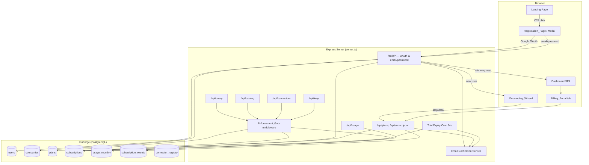
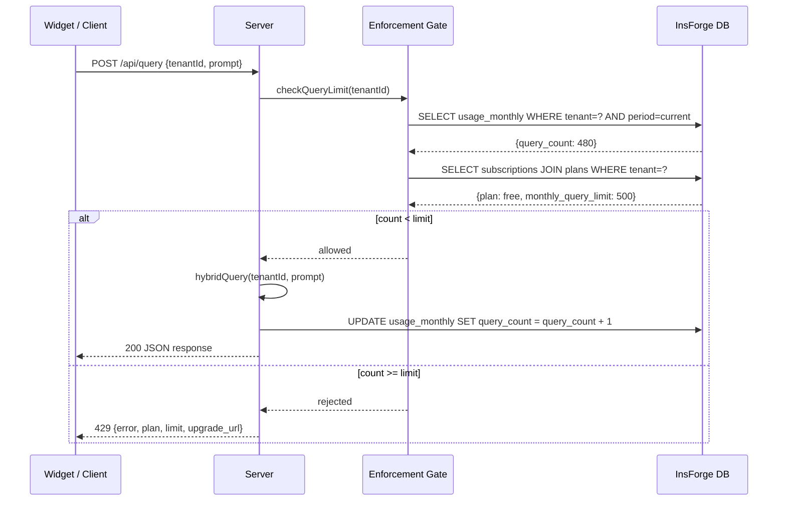
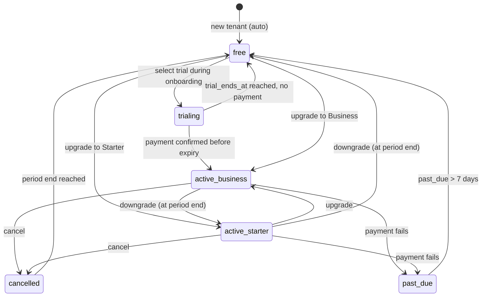

# Design Document: User Registration, Onboarding & Plans

## Overview

This feature extends Eteba Chat from a direct-login SaaS to a full self-serve platform with structured
sign-up, guided onboarding, and a metered subscription model. The current flow drops new tenants onto the
dashboard with no context and no plan; this design introduces:

- A **Registration Page** supporting Google OAuth and email/password sign-up
- A **5-step Onboarding Wizard** that guides tenants through business configuration and plan selection
- A **Subscription Plan system** (Free, Starter, Business, Enterprise) with per-tenant usage tracking
- An **Enforcement Gate** middleware that enforces plan limits at the API level
- A **Billing Portal** and dashboard usage widgets for self-serve plan management
- An **Email notification system** for plan events (welcome, trial expiry, limit warnings, upgrades)

### Design Decisions

1. **InsForge SDK for all DB/auth/email**: The project already uses `@insforge/sdk` exclusively. All new
   tables, RLS policies, and email sends use the same SDK pattern — no new database drivers introduced.
2. **Server-side plan enforcement only**: Clients never write to `plan_id`, `status`, or `trial_ends_at`.
   All state transitions go through Express routes; RLS policies enforce this as a hard constraint.
3. **Atomic `query_count` increments via SQL**: `UPDATE usage_monthly SET query_count = query_count + 1`
   avoids race conditions without introducing distributed locks.
4. **In-memory plan/limits cache with 5-minute TTL**: Plan definitions change rarely; caching avoids a DB
   lookup on every enforced request while keeping changes responsive.
5. **`subscription_events` audit log**: Every state transition is recorded server-side before the
   subscription record is updated, forming a tamper-evident chain.
6. **Trial once per tenant**: Tracked via `trial_used_at` on the subscription record. No second trial is
   allowed, enforced at both the UI and server layer.
7. **Onboarding completion flag on `users` table**: `onboarding_completed` + `onboarding_step` columns
   allow resuming the wizard at the correct step after page refresh.
8. **Soft downgrade on over-limit**: When a tenant downgrades and is already over the new plan's limits,
   the downgrade proceeds but creation of new over-limit resources is blocked until they reduce usage.

## Architecture



### Request Flow — Query with Enforcement



### Trial State Machine



## Components and Interfaces

### 1. Registration Handler (`server.ts` — new auth routes)

```typescript
// POST /auth/register — email/password sign-up
interface RegisterRequest {
  name: string;        // 2–128 chars
  email: string;       // valid email, unique
  password: string;    // min 8 chars
  passwordConfirm: string;
}

interface RegisterResponse {
  token: string;       // signed JWT payload
  user: { id: string; email: string; name: string; role: string; tenantId: string };
  isNewUser: true;
}

// POST /auth/login — email/password sign-in
interface LoginRequest {
  email: string;
  password: string;
}

// Password is hashed with bcrypt (cost factor 12) before storage in users.password_hash
// Existing /auth/google route already handles OAuth; new users get redirected to onboarding
```

### 2. Onboarding API (`server.ts` — new onboarding routes)

```typescript
// POST /api/onboarding/step — persist step data
interface OnboardingStepRequest {
  step: 1 | 2 | 3 | 4 | 5;
  data: OnboardingStepData;
}

type OnboardingStepData =
  | { businessName: string; country: string }                         // step 1
  | { businessType: BusinessType }                                    // step 2
  | { planId: 'free' | 'starter' | 'business' | 'enterprise' | 'trial' } // step 3
  | { assistantManual: string; language: string }                    // step 4
  | { widgetCodeCopied?: boolean }                                    // step 5

// POST /api/onboarding/complete — finalize wizard
interface OnboardingCompleteResponse {
  success: true;
  onboarding_completed_at: string;
}

// GET /api/onboarding/status
interface OnboardingStatusResponse {
  completed: boolean;
  currentStep: number;   // 1-5, 0 if not started
  stepData: Record<number, any>;
}
```

### 3. Plan & Subscription API (`server.ts` — new plan routes)

```typescript
// GET /api/plans — list all plans (public)
interface PlanRecord {
  id: 'free' | 'starter' | 'business' | 'enterprise';
  name: string;
  monthly_query_limit: number | null;
  product_limit: number | null;
  connector_limit: number;
  api_key_limit: number | null;
  price_monthly_usd: number;
  price_yearly_usd: number;
  features: string[];
}

// GET /api/subscription — get current tenant subscription (auth required)
interface SubscriptionResponse {
  subscription: SubscriptionRecord;
  plan: PlanRecord;
  usage: UsageSummary;
  daysUntilTrialEnd?: number;   // only when status=trialing
}

// POST /api/subscription/upgrade — change to higher plan
interface UpgradeRequest { newPlanId: string }

// POST /api/subscription/downgrade — schedule downgrade
interface DowngradeRequest { newPlanId: string }

// POST /api/subscription/cancel
// POST /api/subscription/trial — activate Business trial
```

### 4. Enforcement Gate Middleware

```typescript
// Middleware factory — wraps individual resource checks
type ResourceType = 'query' | 'product' | 'connector' | 'api_key';

interface PlanLimitsCache {
  cache: Map<string, { limits: PlanRecord; fetchedAt: number }>;
  TTL: 5 * 60 * 1000; // 5 minutes
}

async function enforcePlanLimit(
  resource: ResourceType,
  tenantId: string
): Promise<{ allowed: boolean; reason?: string; upgradeUrl?: string }>;

// Applied as Express middleware:
// POST /api/query         → enforcePlanLimit('query', tenantId)
// POST /api/catalog       → enforcePlanLimit('product', tenantId)
// POST /api/connectors    → enforcePlanLimit('connector', tenantId)
// POST /api/keys/generate → enforcePlanLimit('api_key', tenantId)
```

### 5. Usage Tracker

```typescript
// Atomic query increment (called after successful query processing)
async function incrementQueryCount(tenantId: string): Promise<void>;
// Uses: UPDATE usage_monthly SET query_count = query_count + 1,
//              updated_at = now()
//       WHERE tenant_id = $1 AND period_year = $2 AND period_month = $3

// Re-compute snapshot counts (called after catalog/connector/key CRUD)
async function syncResourceCounts(tenantId: string): Promise<void>;
// Computes product_count, connector_count, api_key_count from actual rows

// Returns current usage vs plan limits for dashboard display
async function getUsageSummary(tenantId: string): Promise<UsageSummary>;

interface UsageSummary {
  period: { year: number; month: number };
  query_count: number;
  product_count: number;
  connector_count: number;
  api_key_count: number;
  limits: {
    monthly_query_limit: number | null;
    product_limit: number | null;
    connector_limit: number;
    api_key_limit: number | null;
  };
  percentages: {
    queries: number;   // 0–100+
    products: number;
    connectors: number;
    api_keys: number;
  };
}
```

### 6. Email Notification Service

```typescript
// Wraps InsForge email sending with retry logic and deduplication
type EmailType =
  | 'welcome'
  | 'trial_expiry'
  | 'soft_limit_warning'
  | 'hard_limit_reached'
  | 'upgrade_confirmed'
  | 'downgrade_warning'    // 3 days before
  | 'downgrade_confirmed'
  | 'past_due_downgrade';

async function sendPlanEmail(
  tenantId: string,
  emailType: EmailType,
  payload: Record<string, any>
): Promise<void>;
// - Uses insforge.email.send() from @insforge/sdk
// - Deduplication: for soft_limit_warning, checks email_sent_at in usage_monthly
//   to prevent duplicate sends within the same billing period
// - Retry: up to 3 attempts within 24 hours on provider error
// - Logs failures to server console with tenantId, emailType, error
```

### 7. Trial Expiry Job

```typescript
// Runs periodically (every hour via setInterval or InsForge schedule)
async function checkTrialExpirations(): Promise<void>;
// 1. SELECT subscriptions WHERE status='trialing' AND trial_ends_at <= now()
// 2. For each expired trial:
//    a. Log to subscription_events (event_type='trial_expiry')
//    b. UPDATE subscriptions SET plan_id='free', status='active'
//    c. sendPlanEmail(tenantId, 'trial_expiry', {...})
```

### 8. Frontend Components (vanilla JS modules)

```
Registration_Page  — scripts/registration.js
  - Renders modal/page with Google OAuth button and email/password form
  - Client-side validation: password length, password match
  - Shows inline field errors before submit
  - Calls POST /auth/register or redirects to /auth/google

OnboardingWizard   — scripts/onboarding.js
  - Step controller: renders one step at a time, advances/retreats
  - Saves step data to memory and calls POST /api/onboarding/step
  - Progress bar: calculates (currentStep / 5) * 100
  - Resume logic: on load, calls GET /api/onboarding/status

Billing_Portal     — part of scripts/dashboard.js
  - Fetches GET /api/subscription to populate plan table
  - Renders upgrade/downgrade comparison cards
  - Calls POST /api/subscription/upgrade|downgrade|cancel
  - Shows trial countdown if status=trialing

Dashboard_Usage    — part of scripts/dashboard.js
  - Fetches GET /api/usage to populate progress bars
  - Applies CSS classes: usage--normal, usage--warning (>=80%), usage--critical (>=95%)
  - Shows Plan_Badge in header with plan-specific color class
  - Shows limit-reached banner when percentage >= 100

Landing_Pricing    — part of index.html / scripts/app.js
  - Static pricing cards with billing toggle (monthly/annual)
  - "Most Popular" badge on Business card
  - CTAs call Registration_Page with pre-selected plan context
```

## Data Models

### SQL Migration 007 — Plans and Subscriptions

```sql
-- 007-plans-subscriptions.sql

-- 1. Plans table (static configuration; seeded once)
CREATE TABLE plans (
    id TEXT PRIMARY KEY,  -- 'free', 'starter', 'business', 'enterprise'
    name TEXT NOT NULL,
    monthly_query_limit INTEGER,   -- NULL = unlimited
    product_limit INTEGER,          -- NULL = unlimited
    connector_limit INTEGER NOT NULL DEFAULT 1,
    api_key_limit INTEGER,          -- NULL = unlimited
    price_monthly_usd NUMERIC(8,2) NOT NULL DEFAULT 0,
    price_yearly_usd  NUMERIC(8,2) NOT NULL DEFAULT 0,
    features JSONB NOT NULL DEFAULT '[]'
);

-- Seed plan data
INSERT INTO plans VALUES
  ('free',       'Free',       500,   50,    1, 0,     0.00,    0.00,
   '["Widget embedding","500 queries/month","50 products","1 connector"]'),
  ('starter',    'Starter',    3000,  500,   1, 2,     19.00,   190.00,
   '["Widget embedding","3,000 queries/month","500 products","1 connector","2 API keys","Custom personality","Email support"]'),
  ('business',   'Business',   15000, 5000,  3, 10,    49.00,   490.00,
   '["Widget embedding","15,000 queries/month","5,000 products","3 connectors","10 API keys","Custom personality","Priority support","Analytics dashboard"]'),
  ('enterprise', 'Enterprise', NULL,  NULL,  999, NULL, 0.00,   0.00,
   '["Unlimited queries","Unlimited products","Unlimited connectors","Unlimited API keys","Dedicated support","Custom integrations"]');

-- 2. Subscriptions table
CREATE TABLE subscriptions (
    id UUID PRIMARY KEY DEFAULT gen_random_uuid(),
    tenant_id UUID NOT NULL UNIQUE REFERENCES companies(id) ON DELETE CASCADE,
    plan_id TEXT NOT NULL REFERENCES plans(id),
    status TEXT NOT NULL DEFAULT 'active'
        CHECK (status IN ('active', 'trialing', 'past_due', 'cancelled')),
    trial_ends_at TIMESTAMPTZ,
    trial_used_at TIMESTAMPTZ,         -- non-null once trial has been used
    current_period_start TIMESTAMPTZ NOT NULL DEFAULT now(),
    current_period_end   TIMESTAMPTZ NOT NULL,
    scheduled_plan_id TEXT REFERENCES plans(id), -- pending downgrade target
    created_at TIMESTAMPTZ DEFAULT now(),
    updated_at TIMESTAMPTZ DEFAULT now()
);

CREATE INDEX idx_subscriptions_tenant ON subscriptions(tenant_id);
CREATE INDEX idx_subscriptions_status ON subscriptions(status);
CREATE INDEX idx_subscriptions_trial_ends ON subscriptions(trial_ends_at)
    WHERE status = 'trialing';

ALTER TABLE subscriptions ENABLE ROW LEVEL SECURITY;
-- Tenants can read only their own subscription
CREATE POLICY subs_tenant_read ON subscriptions
    FOR SELECT USING (tenant_id = get_current_tenant_id());
-- No direct INSERT/UPDATE/DELETE from client (server uses service role key)

-- 3. Usage monthly table
CREATE TABLE usage_monthly (
    id UUID PRIMARY KEY DEFAULT gen_random_uuid(),
    tenant_id UUID NOT NULL REFERENCES companies(id) ON DELETE CASCADE,
    period_year  INTEGER NOT NULL,
    period_month INTEGER NOT NULL CHECK (period_month BETWEEN 1 AND 12),
    query_count     INTEGER NOT NULL DEFAULT 0,
    product_count   INTEGER NOT NULL DEFAULT 0,
    connector_count INTEGER NOT NULL DEFAULT 0,
    api_key_count   INTEGER NOT NULL DEFAULT 0,
    soft_limit_email_sent_at TIMESTAMPTZ,  -- dedup soft-limit warning email
    updated_at TIMESTAMPTZ DEFAULT now(),
    UNIQUE(tenant_id, period_year, period_month)
);

CREATE INDEX idx_usage_monthly_tenant ON usage_monthly(tenant_id);
CREATE INDEX idx_usage_monthly_period ON usage_monthly(period_year, period_month);

ALTER TABLE usage_monthly ENABLE ROW LEVEL SECURITY;
-- Tenants can read only their own usage
CREATE POLICY usage_tenant_read ON usage_monthly
    FOR SELECT USING (tenant_id = get_current_tenant_id());
-- No direct writes from client

-- 4. Subscription events (audit log)
CREATE TABLE subscription_events (
    id UUID PRIMARY KEY DEFAULT gen_random_uuid(),
    subscription_id UUID NOT NULL REFERENCES subscriptions(id) ON DELETE CASCADE,
    event_type TEXT NOT NULL,  -- 'created','upgrade','downgrade','trial_start','trial_expiry',
                                --  'cancellation','reactivation','past_due_downgrade'
    old_plan_id TEXT,
    new_plan_id TEXT NOT NULL,
    triggered_by TEXT NOT NULL CHECK (triggered_by IN ('user', 'system', 'trial_expiry')),
    metadata JSONB DEFAULT '{}',
    created_at TIMESTAMPTZ DEFAULT now()
);

CREATE INDEX idx_sub_events_sub ON subscription_events(subscription_id);
CREATE INDEX idx_sub_events_created ON subscription_events(created_at DESC);
```

### SQL Migration 008 — Onboarding Columns on Users

```sql
-- 008-onboarding-users.sql

ALTER TABLE users
    ADD COLUMN IF NOT EXISTS password_hash TEXT,            -- NULL for OAuth-only users
    ADD COLUMN IF NOT EXISTS onboarding_completed BOOLEAN NOT NULL DEFAULT false,
    ADD COLUMN IF NOT EXISTS onboarding_completed_at TIMESTAMPTZ,
    ADD COLUMN IF NOT EXISTS onboarding_step INTEGER NOT NULL DEFAULT 0,
    ADD COLUMN IF NOT EXISTS onboarding_step_data JSONB NOT NULL DEFAULT '{}';

CREATE INDEX IF NOT EXISTS idx_users_onboarding ON users(onboarding_completed)
    WHERE onboarding_completed = false;
```

### RLS Summary

| Table | Tenant READ | Tenant WRITE | Server (service key) |
|---|---|---|---|
| `plans` | All rows (public) | None | Full |
| `subscriptions` | Own row only | None | Full |
| `usage_monthly` | Own rows only | None | Full |
| `subscription_events` | Own rows only (via sub) | None | Full |
| `users` | Own row only | Own name/avatar | Full |

All server-side mutations use the InsForge service-role key (stored in `.env.local` as
`INSFORGE_SERVICE_KEY`) which bypasses RLS — never exposed to clients.

## Correctness Properties

*A property is a characteristic or behavior that should hold true across all valid executions of a
system — essentially, a formal statement about what the system should do. Properties serve as the
bridge between human-readable specifications and machine-verifiable correctness guarantees.*

### Property 1: Valid Registration Always Creates Tenant Records

*For any* valid registration payload (name with 2–128 characters, syntactically valid unique email,
password of length ≥ 8), submitting the registration should always result in exactly one `users` row
and one `companies` row with `owner_id` pointing to the new user, and an auth token should be returned.

**Validates: Requirements 1.3, 3.8**

---

### Property 2: Password Validation Rejects All Short Passwords

*For any* string of length 1–7 submitted as a password in the registration form, the validation should
reject it before reaching the server, and the server should also reject it if it arrives directly. No
short password should ever result in a user record being created.

**Validates: Requirements 1.5**

---

### Property 3: Welcome Email Contains User Name

*For any* successfully registered tenant (via any method), the welcome email sent by the server should
contain a string matching the user's registered name in the email body.

**Validates: Requirements 1.9, 10.1**

---

### Property 4: New Tenant Always Gets Free Subscription

*For any* new tenant account created (via Google OAuth or email/password), exactly one `subscriptions`
record should exist for that tenant with `plan_id = 'free'`, `status = 'active'`, and
`current_period_end` set to the end of the current calendar month.

**Validates: Requirements 3.8**

---

### Property 5: Onboarding Step Data Survives Page Reload

*For any* step number (1–4) and any valid step payload, submitting that step's data via
`POST /api/onboarding/step` and then calling `GET /api/onboarding/status` should return the same
step data under the matching step key — regardless of how many times the page is reloaded between
the two calls.

**Validates: Requirements 2.4, 2.5**

---

### Property 6: Trial Subscription Sets Correct Expiry

*For any* tenant who activates the Business trial, the resulting subscription should have
`status = 'trialing'`, `plan_id = 'business'`, and `trial_ends_at` in the range
`[now + 13d 23h, now + 14d 1h]` (14 days ± 1 hour to allow for processing time).

**Validates: Requirements 4.1**

---

### Property 7: Trial Cannot Be Activated Twice

*For any* tenant whose subscription record has a non-null `trial_used_at` field, attempting to
activate a trial again (via `POST /api/subscription/trial`) should always be rejected with an error,
and the subscription record should remain unchanged.

**Validates: Requirements 4.5**

---

### Property 8: Trialing Tenants Get Business-Tier Limits

*For any* tenant with `status = 'trialing'` and `trial_ends_at` in the future, the Enforcement Gate
should apply Business plan limits (monthly_query_limit = 15,000, product_limit = 5,000,
connector_limit = 3, api_key_limit = 10) — not Free plan limits.

**Validates: Requirements 4.2**

---

### Property 9: Query Count Increments Are Consistent

*For any* tenant and any number N of AI queries successfully processed in the same billing period,
the `usage_monthly.query_count` for that tenant and period should equal exactly N at the end of all
processing (no double-counts, no missed counts). This includes N concurrent requests fired
simultaneously.

**Validates: Requirements 5.2, 5.6, 11.5**

---

### Property 10: Resource Count Reflects Actual Rows

*For any* sequence of create and delete operations on products, connectors, or API keys for a tenant,
the corresponding `_count` field in `usage_monthly` should always equal the actual number of rows in
the respective table for that tenant after each operation.

**Validates: Requirements 5.3**

---

### Property 11: Enforcement Gate Allows if Count < Limit, Blocks if Count >= Limit

*For any* resource type (query, product, connector, api_key) and *for any* (current_count, limit)
pair: if `current_count < limit` the Enforcement Gate should allow the action; if
`current_count >= limit` the Enforcement Gate should block it with the correct HTTP status (429 for
queries, 403 for everything else) and include the plan name, limit value, and an upgrade URL in the
response body.

**Validates: Requirements 6.1, 6.2, 6.3, 6.4, 6.5, 6.6, 6.7, 6.8**

---

### Property 12: NULL Limit Bypasses All Enforcement

*For any* resource type and *for any* tenant whose plan has `NULL` for that resource's limit field
(Enterprise plan), the Enforcement Gate should unconditionally allow the action regardless of the
current count value.

**Validates: Requirements 6.10**

---

### Property 13: Plan Badge Color Matches Plan Tier

*For any* plan name (`free`, `starter`, `business`, `enterprise`), the Plan_Badge rendered in the
dashboard header should apply exactly the CSS class corresponding to the spec's color mapping
(gray → free, blue → starter, purple → business, gold → enterprise), and never apply a color class
from a different plan's mapping.

**Validates: Requirements 8.1**

---

### Property 14: Progress Bar Color Class Reflects Usage Percentage

*For any* (current_count, limit) pair where limit > 0: the progress bar component should apply CSS
class `usage--normal` when `current/limit < 0.80`, `usage--warning` when `0.80 ≤ current/limit < 0.95`,
and `usage--critical` when `current/limit ≥ 0.95`.

**Validates: Requirements 8.2**

---

### Property 15: Every Subscription Transition Creates an Audit Entry

*For any* subscription state change (upgrade, downgrade, trial activation, trial expiry,
cancellation, reactivation, past_due downgrade), exactly one `subscription_events` row should be
written with the correct `event_type`, `old_plan_id`, `new_plan_id`, and `triggered_by` values
before the `subscriptions` record is updated.

**Validates: Requirements 11.3**

---

### Property 16: Audit Log Forms a Valid Transition Chain

*For all* `subscription_events` rows belonging to a single subscription, ordered by `created_at`,
each event's `old_plan_id` should equal the `new_plan_id` of the immediately preceding event (or be
NULL for the first event). No gap or inconsistency should exist in the chain.

**Validates: Requirements 11.6**

---

### Property 17: Upgrade Preserves Plan Monotonicity

*For any* confirmed upgrade request where `new_plan_id` ranks higher than the current `plan_id` in
the tier order (free < starter < business < enterprise), the resulting subscription should have
`plan_id = new_plan_id`, `status = 'active'`, and `current_period_end ≈ now + 30 days` (±1 hour).

**Validates: Requirements 7.2**

---

### Property 18: Downgrade Is Always Scheduled, Never Immediate

*For any* downgrade request submitted when `current_period_end` is in the future, the subscription
record immediately after the request should still have the original `plan_id` (unchanged), and a
`scheduled_plan_id` field set to the requested lower plan. Only after `current_period_end` is
reached should `plan_id` change to the scheduled value.

**Validates: Requirements 7.3, 7.4**

---

### Property 19: Soft Limit Warning Email Sent At Most Once Per Period

*For any* tenant and any billing period, no matter how many times the `query_count` crosses the 80%
threshold during that period, at most one soft-limit warning email of type `soft_limit_warning`
should be sent to that tenant for that period.

**Validates: Requirements 10.3**

## Error Handling

### Registration Errors

| Condition | Detection | HTTP Status | Response |
|---|---|---|---|
| Email already registered | Unique index violation | 409 | `{error: "email_exists", message: "...", signInUrl: "/auth/login"}` |
| Password too short | Server validation | 400 | `{error: "validation", field: "password", message: "Min 8 characters"}` |
| Password mismatch | Server validation | 400 | `{error: "validation", field: "passwordConfirm", message: "Passwords do not match"}` |
| Missing required field | Schema validation | 400 | `{error: "validation", fields: [...]}` |
| Google OAuth failure | Google returns error | 400 | Redirect to landing with `?auth_error=oauth_failed` |
| Email send failure | InsForge email error | — | Log failure; do not block registration |

### Enforcement Gate Errors

| Condition | HTTP Status | Response body |
|---|---|---|
| Query limit reached | 429 | `{error: "query_limit_reached", plan: "free", limit: 500, upgradeUrl: "..."}` |
| Product limit reached | 403 | `{error: "product_limit_reached", plan: "starter", limit: 500, upgradeUrl: "..."}` |
| Connector limit reached | 403 | `{error: "connector_limit_reached", ...}` |
| API key limit reached | 403 | `{error: "api_key_limit_reached", ...}` |
| Feature not in plan | 403 | `{error: "feature_unavailable", feature: "...", requiredPlan: "starter", upgradeUrl: "..."}` |

### Subscription Errors

| Condition | HTTP Status | Response |
|---|---|---|
| Trial already used | 409 | `{error: "trial_already_used"}` |
| Invalid plan_id | 400 | `{error: "invalid_plan"}` |
| Downgrade to same or higher plan | 400 | `{error: "invalid_downgrade"}` |
| Subscription not found | 404 | `{error: "subscription_not_found"}` |
| Concurrent upgrade conflict | 409 | `{error: "concurrent_modification"}` (retry) |

### Email Notification Errors

| Condition | Handling |
|---|---|
| InsForge email provider error | Log `{tenantId, emailType, error, attempt}`, retry up to 3 times, max one retry cycle per 24 hours |
| Invalid email address | Log and skip; do not block the triggering action |
| Duplicate send (soft limit) | Check `soft_limit_email_sent_at`; skip if already sent this period |

### Graceful Degradation

1. **Usage DB unavailable during query**: Log error, allow the query to proceed (fail-open to avoid blocking paying customers), increment counter on next opportunity via background job.
2. **Plan cache miss**: Fall back to direct DB lookup; performance degrades slightly but enforcement stays correct.
3. **Trial expiry job failure**: Retry on next scheduled run; tenants retain trial access until the job succeeds (no data is lost).
4. **Onboarding step save failure**: Return error to the wizard UI; user sees a toast and can retry the step — no data is silently discarded.

## Testing Strategy

### Unit Tests (Example-based)

Focus on specific behaviors with concrete inputs:

- **Registration validation**: Test email uniqueness rejection, password length boundary (7 chars → reject, 8 chars → accept), password mismatch rejection
- **Plan seeding**: Verify exactly 4 plan records with correct limit values after migration
- **Onboarding step sequencing**: Verify wizard step order, step 5 completion sets flag correctly
- **Subscription initial state**: Verify Free subscription created on new tenant, correct period end
- **Trial activation**: Verify trial subscription fields, verify second trial rejected
- **Billing portal upgrade flow**: Verify subscription fields after upgrade (plan_id, period dates)
- **Downgrade scheduling**: Verify scheduled_plan_id set, plan_id unchanged immediately
- **Email deduplication**: Verify `soft_limit_email_sent_at` prevents duplicate sends
- **Audit log entry**: Verify one event row per state change with correct fields

### Property-Based Tests

**Library**: `fast-check` (already compatible with the project's TypeScript/Node.js stack)

**Configuration**: Each property test runs minimum 100 iterations.

**Tag format**: `Feature: user-registration-onboarding-plans, Property {N}: {title}`

| Property # | Test Description | Key Generators |
|---|---|---|
| 1 | Valid registration creates tenant records | `fc.record({name: fc.string(2,128), email: fc.emailAddress(), password: fc.string(8,64)})` |
| 2 | Short passwords always rejected | `fc.string(1, 7)` as password |
| 3 | Welcome email contains user name | `fc.string(2,64)` as user name |
| 4 | New tenant gets Free subscription | `fc.record({name, email, password})` for registration |
| 5 | Onboarding step data survives reload | `fc.constantFrom(1,2,3,4)` × random step payloads |
| 6 | Trial sets correct expiry | `fc.uuid()` for tenantId, verify date range |
| 7 | Trial cannot be activated twice | Any tenant with `trial_used_at` set |
| 8 | Trialing tenants get Business limits | Any tenant with active trial |
| 9 | Query count increments are consistent | `fc.nat({max: 200})` for N concurrent queries |
| 10 | Resource count reflects actual rows | `fc.array(fc.constantFrom('create','delete'))` for operation sequences |
| 11 | Enforcement gate allows/blocks correctly | `fc.nat()` for count, `fc.nat()` for limit |
| 12 | NULL limit bypasses enforcement | Any resource type for enterprise tenant |
| 13 | Plan badge color matches tier | `fc.constantFrom('free','starter','business','enterprise')` |
| 14 | Progress bar color class is correct | `fc.nat()` for count, `fc.nat({min:1})` for limit |
| 15 | Every transition creates audit entry | `fc.constantFrom(...eventTypes)` × plan transitions |
| 16 | Audit chain is consistent | `fc.array(fc.constantFrom(...planIds), {minLength: 2})` for transition sequences |
| 17 | Upgrade preserves plan monotonicity | Any valid (from, to) upgrade pair |
| 18 | Downgrade is always scheduled | Any valid downgrade request with future period_end |
| 19 | Soft limit email sent at most once per period | `fc.nat({min:1, max:10})` for threshold crossings |

### Integration Tests

- **End-to-end registration → onboarding → plan selection**: Full flow from POST /auth/register through onboarding completion, verify DB state at each step
- **Trial expiry cycle**: Activate trial, simulate time advance, run expiry job, verify Free downgrade and email log
- **Concurrent query enforcement**: Send 10 requests simultaneously at the limit boundary, verify none exceed it
- **Plan upgrade and downgrade**: Upgrade from Free → Business, verify limits change; schedule downgrade, advance period, verify application
- **Past_due auto-downgrade**: Set status to past_due 8 days ago, run cron, verify free downgrade and email
- **RLS enforcement**: Attempt direct `UPDATE subscriptions SET plan_id = 'enterprise'` via InsForge anon key, verify rejection

### Test Environment

- **Test DB**: InsForge test project or local Postgres with all migrations applied (001–008)
- **Mock email**: Intercept `insforge.email.send()` calls in tests; assert on call arguments
- **Plan cache**: Reset cache between tests to avoid cross-test contamination
- **Time control**: Use dependency-injected `now()` function (defaults to `Date.now()`) for deterministic trial/period expiry tests
- **Environment**: Separate `.env.test` with test InsForge keys and a distinct test project
