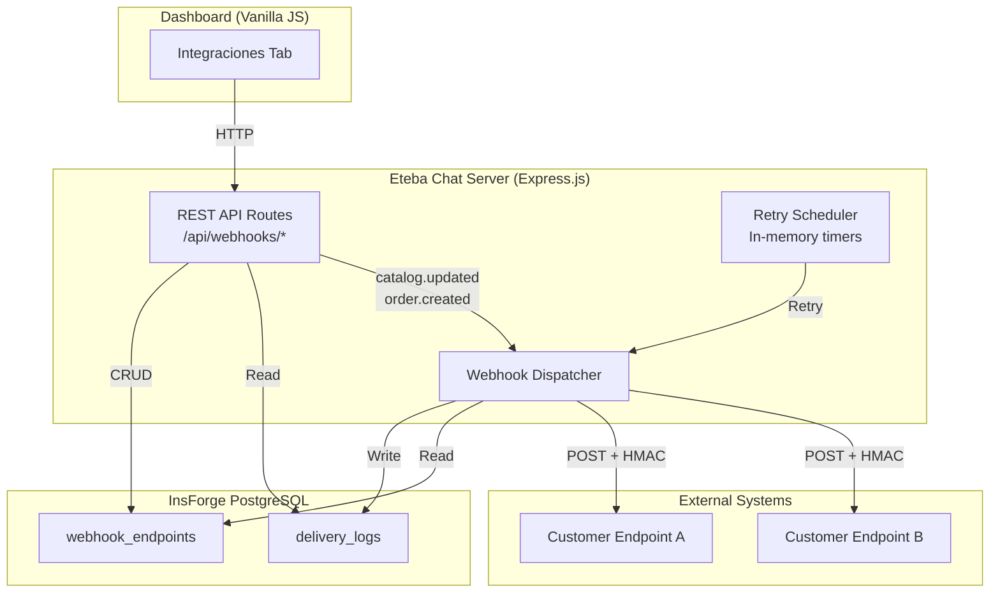
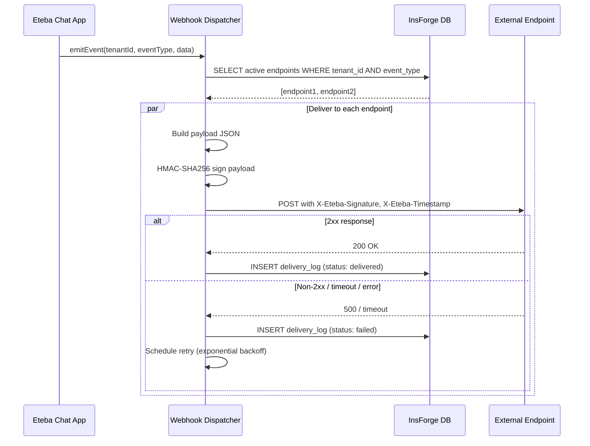
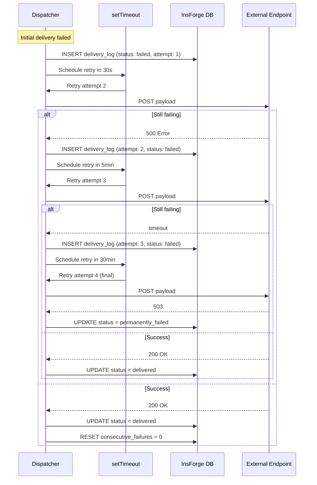

# Design Document: Webhook Integrations

## Overview

This design adds a webhook integration subsystem to the Eteba Chat platform. The system allows dashboard users to register HTTP endpoints that receive real-time POST notifications when key business events occur within their tenant. The architecture is built around three core components:

1. **REST API layer** — CRUD endpoints for managing webhook endpoints and delivery logs
2. **Webhook Dispatcher** — An event-driven component that detects events, signs payloads, delivers them to registered endpoints, and handles retries
3. **Dashboard UI** — A new "Integraciones" tab in the existing vanilla JS dashboard for endpoint management

The design follows existing project patterns: Express.js route handlers, InsForge database operations with `tenant_id` filtering, base64url token auth, and vanilla JS frontend modules.

## Architecture

### High-Level Architecture Diagram



### Event Flow Sequence Diagram



### Design Decisions

| Decision | Rationale |
|----------|-----------|
| In-memory retry scheduler (setTimeout) | The app runs as a single Render instance. No need for external queue (Redis/SQS) at current scale. Retries are lost on restart but delivery logs allow manual retry. |
| Signing secret stored encrypted at rest | HMAC secrets are sensitive. Stored as hex strings; shown once to user. |
| Fire-and-forget event emission | Webhook delivery is async — the triggering API response is not delayed. Matches existing `query_counts` pattern. |
| Tenant isolation via WHERE clause | Consistent with existing `tenant_id` filtering pattern across all tables. |
| 10 endpoints per tenant limit | Prevents abuse and unbounded fan-out at early stage. |

## Components and Interfaces

### 1. Webhook API Routes (`server.ts` additions)

| Method | Path | Description |
|--------|------|-------------|
| POST | `/api/webhooks` | Create a new webhook endpoint |
| GET | `/api/webhooks` | List all endpoints for tenant |
| PUT | `/api/webhooks/:id` | Update endpoint URL/events |
| PATCH | `/api/webhooks/:id/toggle` | Toggle active/inactive status |
| DELETE | `/api/webhooks/:id` | Delete endpoint + logs |
| POST | `/api/webhooks/:id/test` | Send test.ping delivery |
| POST | `/api/webhooks/:id/regenerate-secret` | Regenerate signing secret |
| GET | `/api/webhooks/:id/logs` | List delivery logs (paginated) |
| POST | `/api/webhooks/logs/:logId/retry` | Manual retry of failed delivery |

### 2. Webhook Dispatcher Module

```typescript
// webhook-dispatcher.ts
interface WebhookDispatcher {
  emitEvent(tenantId: string, eventType: EventType, data: Record<string, any>): Promise<void>;
  deliverToEndpoint(endpoint: WebhookEndpoint, payload: WebhookPayload): Promise<DeliveryResult>;
  scheduleRetry(deliveryLogId: string, attempt: number): void;
  sendTestPing(endpointId: string, tenantId: string): Promise<DeliveryResult>;
}

type EventType = 'order.created' | 'conversation.started' | 'message.received' | 'catalog.updated' | 'test.ping';

interface WebhookPayload {
  id: string;           // unique delivery ID (UUID)
  event: EventType;
  timestamp: string;    // ISO 8601
  tenant_id: string;
  data: Record<string, any>;
}

interface DeliveryResult {
  success: boolean;
  statusCode?: number;
  responseBody?: string;
  error?: string;
}
```

### 3. Auth Middleware (Tenant Extraction)

All webhook API routes require authentication. The tenant ID is extracted from the existing base64url token:

```typescript
function extractTenantId(req: express.Request): string | null {
  const token = req.headers.authorization?.replace('Bearer ', '') || req.query.token as string;
  if (!token) return null;
  try {
    const payload = JSON.parse(Buffer.from(token, 'base64url').toString());
    return payload.tenantId || payload.id || null;
  } catch {
    return null;
  }
}
```

### 4. Dashboard UI Component

A new `Integraciones` tab added to the sidebar. Uses the existing modal/toast/table patterns from `dashboard.js`.

## Data Models

### Database Schema (SQL Migration: `006-webhook-integrations.sql`)

```sql
-- =========================================================================
-- MIGRACIÓN: Webhook Integrations
-- =========================================================================

-- 1. Tabla de endpoints de webhook
CREATE TABLE webhook_endpoints (
    id UUID PRIMARY KEY DEFAULT gen_random_uuid(),
    tenant_id UUID NOT NULL REFERENCES companies(id) ON DELETE CASCADE,
    url TEXT NOT NULL,
    events TEXT[] NOT NULL DEFAULT '{}',
    signing_secret TEXT NOT NULL,
    is_active BOOLEAN NOT NULL DEFAULT true,
    consecutive_failures INTEGER NOT NULL DEFAULT 0,
    created_at TIMESTAMPTZ DEFAULT now(),
    updated_at TIMESTAMPTZ DEFAULT now(),
    CONSTRAINT url_length CHECK (char_length(url) <= 2048),
    CONSTRAINT url_https CHECK (url LIKE 'https://%'),
    CONSTRAINT unique_url_per_tenant UNIQUE (tenant_id, url)
);

CREATE INDEX idx_webhook_endpoints_tenant ON webhook_endpoints(tenant_id);
CREATE INDEX idx_webhook_endpoints_active ON webhook_endpoints(tenant_id, is_active);

-- 2. Tabla de logs de entrega
CREATE TABLE delivery_logs (
    id UUID PRIMARY KEY DEFAULT gen_random_uuid(),
    endpoint_id UUID NOT NULL REFERENCES webhook_endpoints(id) ON DELETE CASCADE,
    tenant_id UUID NOT NULL REFERENCES companies(id) ON DELETE CASCADE,
    event_type TEXT NOT NULL,
    request_payload TEXT,
    response_body TEXT,
    status_code INTEGER,
    status TEXT NOT NULL DEFAULT 'pending',  -- pending, delivered, failed, permanently_failed
    failure_reason TEXT,
    attempt_number INTEGER NOT NULL DEFAULT 1,
    parent_delivery_id UUID REFERENCES delivery_logs(id) ON DELETE SET NULL,
    is_test BOOLEAN NOT NULL DEFAULT false,
    created_at TIMESTAMPTZ DEFAULT now()
);

CREATE INDEX idx_delivery_logs_endpoint ON delivery_logs(endpoint_id, created_at DESC);
CREATE INDEX idx_delivery_logs_tenant ON delivery_logs(tenant_id);
CREATE INDEX idx_delivery_logs_status ON delivery_logs(status) WHERE status IN ('failed', 'permanently_failed');
CREATE INDEX idx_delivery_logs_cleanup ON delivery_logs(created_at) WHERE created_at < now() - interval '30 days';

-- 3. RLS Policies
ALTER TABLE webhook_endpoints ENABLE ROW LEVEL SECURITY;
ALTER TABLE delivery_logs ENABLE ROW LEVEL SECURITY;

CREATE POLICY webhook_endpoints_tenant_isolation ON webhook_endpoints
    FOR ALL USING (tenant_id = get_current_tenant_id());

CREATE POLICY delivery_logs_tenant_isolation ON delivery_logs
    FOR ALL USING (tenant_id = get_current_tenant_id());
```

### TypeScript Interfaces

```typescript
interface WebhookEndpoint {
  id: string;
  tenant_id: string;
  url: string;
  events: EventType[];
  signing_secret: string;
  is_active: boolean;
  consecutive_failures: number;
  created_at: string;
  updated_at: string;
}

interface DeliveryLog {
  id: string;
  endpoint_id: string;
  tenant_id: string;
  event_type: string;
  request_payload: string | null;
  response_body: string | null;
  status_code: number | null;
  status: 'pending' | 'delivered' | 'failed' | 'permanently_failed';
  failure_reason: string | null;
  attempt_number: number;
  parent_delivery_id: string | null;
  is_test: boolean;
  created_at: string;
}
```

## API Endpoint Specifications

### POST /api/webhooks — Create Endpoint

**Request:**
```json
{
  "url": "https://example.com/webhook",
  "events": ["order.created", "message.received"]
}
```

**Validations:**
- URL must start with `https://`
- URL max length: 2048 characters
- `events` must contain 1+ valid event types
- Max 10 endpoints per tenant
- URL must not already be registered for this tenant

**Response (201):**
```json
{
  "success": true,
  "endpoint": {
    "id": "uuid",
    "url": "https://example.com/webhook",
    "events": ["order.created", "message.received"],
    "is_active": true,
    "created_at": "2024-01-15T10:30:00Z"
  },
  "signing_secret": "hex-encoded-32-bytes"
}
```

### GET /api/webhooks — List Endpoints

**Response (200):**
```json
{
  "endpoints": [
    {
      "id": "uuid",
      "url": "https://example.com/webhook",
      "events": ["order.created"],
      "is_active": true,
      "consecutive_failures": 0,
      "created_at": "2024-01-15T10:30:00Z"
    }
  ]
}
```

### PUT /api/webhooks/:id — Update Endpoint

**Request:**
```json
{
  "url": "https://example.com/new-webhook",
  "events": ["order.created", "catalog.updated"]
}
```

**Validations:** Same as create (HTTPS, length, at least one event). Checks endpoint belongs to tenant.

### PATCH /api/webhooks/:id/toggle — Toggle Active Status

**Response (200):**
```json
{
  "success": true,
  "is_active": false
}
```

### DELETE /api/webhooks/:id — Delete Endpoint

Cascading delete removes all associated delivery_logs.

### POST /api/webhooks/:id/test — Test Delivery

**Rate limit:** One test per endpoint per 5 seconds (tracked in-memory).

**Response (200) on success:**
```json
{
  "success": true,
  "status_code": 200,
  "message": "Entrega de prueba exitosa (HTTP 200)"
}
```

**Response (200) on failure:**
```json
{
  "success": false,
  "error": "Timeout: el endpoint no respondió en 10 segundos"
}
```

### POST /api/webhooks/:id/regenerate-secret — Regenerate Secret

**Response (200):**
```json
{
  "success": true,
  "signing_secret": "new-hex-encoded-32-bytes"
}
```

### GET /api/webhooks/:id/logs — Delivery Logs

**Query params:** `page` (default 1), `limit` (default 20, max 20)

**Response (200):**
```json
{
  "logs": [...],
  "pagination": {
    "page": 1,
    "limit": 20,
    "total": 47,
    "totalPages": 3
  }
}
```

### POST /api/webhooks/logs/:logId/retry — Manual Retry

Only allowed for `permanently_failed` deliveries.

## Webhook Dispatcher Design

### Event Detection

Events are emitted from existing API endpoints using a fire-and-forget pattern:

```typescript
// In the order creation handler:
webhookDispatcher.emitEvent(tenantId, 'order.created', { 
  order_id: newOrder.id, 
  product: newOrder.producto_nombre,
  client: newOrder.cliente_nombre 
});

// In the catalog update handler:
webhookDispatcher.emitEvent(tenantId, 'catalog.updated', { 
  product_id: product.id, 
  action: 'created' | 'updated' | 'deleted' 
});

// In the query/conversation handler:
webhookDispatcher.emitEvent(tenantId, 'message.received', { 
  query_id: queryId, 
  query_text: prompt 
});
```

### Delivery Flow

```typescript
async function emitEvent(tenantId: string, eventType: EventType, data: Record<string, any>): Promise<void> {
  // 1. Fetch active endpoints subscribed to this event type
  const { data: endpoints } = await insforge.database
    .from('webhook_endpoints')
    .select('*')
    .eq('tenant_id', tenantId)
    .eq('is_active', true)
    .contains('events', [eventType]);

  if (!endpoints || endpoints.length === 0) return;

  // 2. Deliver to each endpoint independently (parallel, fire-and-forget)
  for (const endpoint of endpoints) {
    deliverToEndpoint(endpoint, eventType, data).catch(() => {});
  }
}
```

### HMAC-SHA256 Signing Mechanism

```typescript
function signPayload(payloadJson: string, secret: string, timestamp: number): string {
  // Sign: timestamp + '.' + payload body
  const signatureBase = `${timestamp}.${payloadJson}`;
  const hmac = crypto.createHmac('sha256', secret);
  hmac.update(signatureBase, 'utf8');
  return hmac.digest('hex');
}
```

**Headers sent with every delivery:**
- `Content-Type: application/json`
- `X-Eteba-Signature: sha256=<hex_digest>`
- `X-Eteba-Timestamp: <unix_seconds>`

**Verification pseudocode for receivers:**
```
expected = HMAC-SHA256(secret, timestamp + "." + raw_body)
valid = timingSafeEqual(received_signature, "sha256=" + expected)
fresh = abs(now() - timestamp) < 300  // 5-minute tolerance
```

### Retry Logic with Exponential Backoff

```typescript
const RETRY_DELAYS = [30_000, 300_000, 1_800_000]; // 30s, 5min, 30min
const MAX_CONSECUTIVE_FAILURES = 50;

function scheduleRetry(deliveryLogId: string, endpoint: WebhookEndpoint, payload: WebhookPayload, attempt: number): void {
  if (attempt > 3) {
    // Mark as permanently failed
    markPermanentlyFailed(deliveryLogId);
    return;
  }

  const delay = RETRY_DELAYS[attempt - 1];
  
  setTimeout(async () => {
    const result = await deliverToEndpoint(endpoint, payload);
    
    if (result.success) {
      // Update original log and reset consecutive failures
      await updateDeliveryStatus(deliveryLogId, 'delivered', result);
      await resetConsecutiveFailures(endpoint.id);
    } else {
      // Record retry attempt
      await recordRetryAttempt(deliveryLogId, attempt + 1, result);
      
      // Increment consecutive failures
      const failures = await incrementConsecutiveFailures(endpoint.id);
      
      if (failures >= MAX_CONSECUTIVE_FAILURES) {
        await deactivateEndpoint(endpoint.id);
        // Cancel pending retries (clear stored timeout IDs)
        cancelPendingRetries(endpoint.id);
      } else {
        scheduleRetry(deliveryLogId, endpoint, payload, attempt + 1);
      }
    }
  }, delay);
}
```

### Retry Flow Sequence Diagram



### Delivery Log Cleanup

A periodic cleanup runs daily (via `setInterval`) to delete logs older than 30 days:

```typescript
// Run every 24 hours
setInterval(async () => {
  await insforge.database
    .from('delivery_logs')
    .delete()
    .lt('created_at', new Date(Date.now() - 30 * 24 * 60 * 60 * 1000).toISOString());
}, 24 * 60 * 60 * 1000);
```

## Correctness Properties

*A property is a characteristic or behavior that should hold true across all valid executions of a system—essentially, a formal statement about what the system should do. Properties serve as the bridge between human-readable specifications and machine-verifiable correctness guarantees.*

### Property 1: URL Validation Accepts Only Valid HTTPS URLs Under 2048 Characters

*For any* string input used as a webhook endpoint URL, the validation function SHALL accept it if and only if it starts with `https://` and has length ≤ 2048 characters. All other strings SHALL be rejected.

**Validates: Requirements 1.2, 1.6, 2.3, 2.4**

### Property 2: Event Type Subscription Validation

*For any* set of event types submitted during endpoint creation or update, the system SHALL accept it if and only if the set is non-empty and every element is one of `order.created`, `conversation.started`, `message.received`, or `catalog.updated`. Any set containing invalid event types or an empty set SHALL be rejected.

**Validates: Requirements 1.4, 2.3**

### Property 3: Signing Secret Generation Quality

*For any* generated signing secret (on creation or regeneration), the secret SHALL be at least 32 bytes (64 hex characters) in length, and any two generated secrets SHALL be distinct.

**Validates: Requirements 1.3, 4.5**

### Property 4: HMAC-SHA256 Signing Round Trip

*For any* JSON payload string and any valid signing secret, computing the HMAC-SHA256 signature and then verifying it by re-computing with the same secret and payload SHALL produce an identical result (deterministic). The `X-Eteba-Signature` header SHALL have the format `sha256=` followed by a valid hexadecimal string of exactly 64 characters.

**Validates: Requirements 4.1, 4.2**

### Property 5: Event Routing Correctness

*For any* tenant ID, any event type, and any set of webhook endpoints (active/inactive, with various event subscriptions), the dispatcher SHALL deliver the event to exactly the endpoints that are both (a) active and (b) subscribed to that event type. No inactive endpoint or endpoint not subscribed to the event SHALL receive a delivery.

**Validates: Requirements 3.1, 3.2, 3.3, 3.4, 2.6**

### Property 6: Delivery Status Classification

*For any* HTTP response received from a webhook endpoint, the delivery SHALL be marked as `delivered` if and only if the status code is in the range [200, 299]. For any status code outside this range, or in cases of timeout or connection error, the delivery SHALL be marked as `failed` with a recorded failure reason.

**Validates: Requirements 3.8, 3.9**

### Property 7: Payload Structure Completeness

*For any* event type and event data delivered to a webhook endpoint, the JSON payload SHALL contain: a non-empty `id` (UUID format), the correct `event` string matching the triggered event type, a `timestamp` in valid ISO 8601 format, the correct `tenant_id`, and a `data` object.

**Validates: Requirements 3.5**

### Property 8: Tenant Isolation on All Operations

*For any* webhook endpoint or delivery log belonging to tenant A, and any API request authenticated as tenant B (where A ≠ B), the system SHALL return HTTP 403 and SHALL NOT reveal the existence of the resource. When listing resources, the response SHALL contain only records belonging to the authenticated tenant.

**Validates: Requirements 8.1, 8.2, 8.3, 8.4, 8.5**

### Property 9: Toggle Inverts Active Status

*For any* webhook endpoint with current `is_active` state S, toggling the active status SHALL result in the persisted state being `!S`.

**Validates: Requirements 2.5**

### Property 10: Cascade Delete Removes Endpoint and All Logs

*For any* webhook endpoint with N associated delivery logs (where N ≥ 0), deleting the endpoint SHALL remove both the endpoint record and all N delivery log records.

**Validates: Requirements 2.8**

### Property 11: Retry Backoff Schedule

*For any* failed delivery, the automatic retry system SHALL schedule at most 3 retry attempts with delays of 30 seconds, 5 minutes, and 30 minutes respectively. After the third retry fails, the delivery status SHALL be `permanently_failed` with no further automatic retries scheduled.

**Validates: Requirements 7.1, 7.3**

### Property 12: Retry Log Linkage

*For any* retry attempt (automatic or manual), the resulting delivery_log entry SHALL have `parent_delivery_id` set to the original delivery's ID and `attempt_number` set to the correct sequential attempt number.

**Validates: Requirements 7.2**

### Property 13: Manual Retry Precondition

*For any* delivery log with status other than `permanently_failed`, a manual retry request SHALL be rejected. Only deliveries with status `permanently_failed` SHALL be eligible for manual retry.

**Validates: Requirements 7.5**

### Property 14: Response Body Truncation

*For any* response body or request payload of length L, the stored value SHALL have length min(L, 1024). If L > 1024, a truncation indicator SHALL be appended.

**Validates: Requirements 6.4**

### Property 15: Delivery Log Pagination

*For any* endpoint with N delivery logs and requested page P (1-indexed), the response SHALL contain at most 20 entries, the entries SHALL be ordered by `created_at` descending, and `totalPages` SHALL equal ceil(N / 20).

**Validates: Requirements 6.1, 6.3**

### Property 16: Test Delivery Flag

*For any* test.ping delivery, the resulting delivery_log entry SHALL have `is_test` set to `true`. For any real event delivery, `is_test` SHALL be `false`.

**Validates: Requirements 5.6**

### Property 17: Secret Regeneration Invalidates Previous Secret

*For any* webhook endpoint, after regenerating the signing secret, payloads signed with the old secret SHALL NOT produce valid signatures when verified with the new secret. The new secret SHALL differ from the old secret.

**Validates: Requirements 4.5**

### Property 18: Endpoint List Ordering

*For any* tenant with multiple webhook endpoints, the list API SHALL return them ordered by `created_at` descending (most recently created first).

**Validates: Requirements 2.1**

## Error Handling

### API Error Responses

All error responses follow a consistent format:

```json
{
  "error": "Mensaje descriptivo en español"
}
```

| Scenario | Status Code | Error Message |
|----------|-------------|---------------|
| Missing/invalid auth token | 401 | "No autorizado" |
| Endpoint belongs to another tenant | 403 | "No autorizado" |
| Endpoint not found | 404 | "Endpoint no encontrado" |
| Invalid URL (not HTTPS) | 400 | "La URL debe usar protocolo HTTPS" |
| URL exceeds 2048 chars | 400 | "La URL no puede exceder 2048 caracteres" |
| No event types selected | 400 | "Debes seleccionar al menos un tipo de evento" |
| Invalid event type | 400 | "Tipo de evento no válido: {type}" |
| Tenant endpoint limit reached (10) | 409 | "Has alcanzado el límite de 10 endpoints" |
| Duplicate URL for tenant | 409 | "Esta URL ya está registrada" |
| Test rate limited | 429 | "Espera 5 segundos antes de enviar otra prueba" |
| Manual retry not allowed (not permanently_failed) | 400 | "Solo se pueden reintentar entregas con fallo permanente" |
| Signing secret missing at dispatch | — | Delivery skipped, log: "Secreto de firma no disponible" |

### Dispatcher Error Handling

The dispatcher uses a defensive approach:

1. **Network errors** (DNS, connection refused, TLS failure) → Caught, logged with specific reason, delivery marked failed
2. **Timeout (10s)** → AbortController signal, marked as "Timeout: el endpoint no respondió en 10 segundos"
3. **Invalid signing secret** → Delivery skipped entirely, log recorded
4. **Database write failure on log** → Console.error, no retry of the log write (best-effort logging)
5. **Endpoint deactivated mid-retry** → Check `is_active` before each retry attempt; skip if deactivated

### Circuit Breaker (Auto-Disable)

When `consecutive_failures` reaches 50:
- Endpoint is set to `is_active = false`
- All pending in-memory retries for that endpoint are cancelled
- A delivery_log entry is created with `failure_reason: "Endpoint desactivado automáticamente por 50 fallos consecutivos"`
- The consecutive failure counter resets on any successful delivery

## Testing Strategy

### Unit Tests (Example-based)

Focus on specific behaviors and edge cases:

- URL validation: HTTP URL rejected, URLs > 2048 chars rejected, valid HTTPS accepted
- Event type validation: empty set rejected, invalid strings rejected, valid set accepted
- Endpoint limit: 11th endpoint rejected with correct error
- Duplicate URL: same URL for same tenant rejected
- Test delivery rate limiting: second request within 5s rejected
- Manual retry precondition: retry rejected for non-permanently_failed statuses
- Empty state responses: correct messages when no endpoints/logs exist
- Secret display: signing_secret NOT included in GET list response

### Property-Based Tests (fast-check)

The project will use [fast-check](https://github.com/dubzzz/fast-check) as the PBT library for TypeScript.

Configuration:
- Minimum 100 iterations per property test
- Each test tagged with: `Feature: webhook-integrations, Property {N}: {title}`

Properties to implement:
1. URL validation correctness (Property 1)
2. Event type set validation (Property 2)
3. Secret generation length and uniqueness (Property 3)
4. HMAC signing determinism and format (Property 4)
5. Event routing to correct endpoints (Property 5)
6. Status classification from HTTP codes (Property 6)
7. Payload structure completeness (Property 7)
8. Tenant isolation enforcement (Property 8)
9. Toggle state inversion (Property 9)
10. Retry schedule correctness (Property 11)
11. Retry log linkage (Property 12)
12. Manual retry precondition (Property 13)
13. Truncation at 1024 chars (Property 14)
14. Pagination correctness (Property 15)
15. Test delivery flag (Property 16)
16. Secret regeneration invalidation (Property 17)
17. List ordering (Property 18)

### Integration Tests

- Full delivery cycle: create endpoint → emit event → verify delivery log
- Timeout handling: endpoint that sleeps > 10s triggers failure
- Retry cycle: endpoint returns 500 three times, verify all retries fire
- Cascade delete: create endpoint with logs, delete, verify all gone
- Cross-tenant access: attempt to access other tenant's endpoint/logs

### Test Infrastructure

```
tests/
  webhook/
    webhook-validation.test.ts     # Property tests for validation logic
    webhook-signing.test.ts        # Property tests for HMAC signing
    webhook-dispatcher.test.ts     # Property tests for routing/status logic
    webhook-api.test.ts            # Integration tests for API endpoints
    webhook-retry.test.ts          # Property + integration tests for retry logic
```

## Dashboard UI Components — Integraciones Tab

### Layout Structure

```
┌─────────────────────────────────────────────────────┐
│ Integraciones                                       │
├─────────────────────────────────────────────────────┤
│ [+ Nuevo Endpoint]                                  │
│                                                     │
│ ┌─────────────────────────────────────────────────┐ │
│ │ https://myapi.com/webhooks                      │ │
│ │ Eventos: order.created, message.received        │ │
│ │ Creado: 15 ene 2024  ● Activo  [Toggle]        │ │
│ │ [Probar] [Editar] [Ver Logs] [Eliminar]         │ │
│ └─────────────────────────────────────────────────┘ │
│                                                     │
│ ┌─────────────────────────────────────────────────┐ │
│ │ https://other.com/hook                          │ │
│ │ Eventos: catalog.updated                        │ │
│ │ Creado: 10 ene 2024  ○ Inactivo [Toggle]       │ │
│ │ [Probar] [Editar] [Ver Logs] [Eliminar]         │ │
│ └─────────────────────────────────────────────────┘ │
│                                                     │
│ (Empty state: "No tienes endpoints configurados")   │
└─────────────────────────────────────────────────────┘
```

### UI Interactions

1. **Create Modal**: URL input + event type checkboxes. On success, shows signing secret with copy button and warning.
2. **Edit Modal**: Pre-filled URL + checkboxes. Same validations.
3. **Toggle**: Inline switch, immediate PATCH call, toast notification.
4. **Test**: Button triggers test.ping. Shows success/error toast.
5. **Logs Panel**: Expandable section below endpoint card or separate modal with paginated table.
6. **Delete**: Confirmation dialog (reusing `showConfirmDialog`).
7. **Regenerate Secret**: Button in edit/detail view. Confirmation required. Shows new secret once.

### Event Badge Mapping

| Event Type | Badge Label | Color |
|------------|-------------|-------|
| order.created | Pedido | green |
| conversation.started | Conversación | blue |
| message.received | Mensaje | purple |
| catalog.updated | Catálogo | orange |
| test.ping | Prueba | gray |

